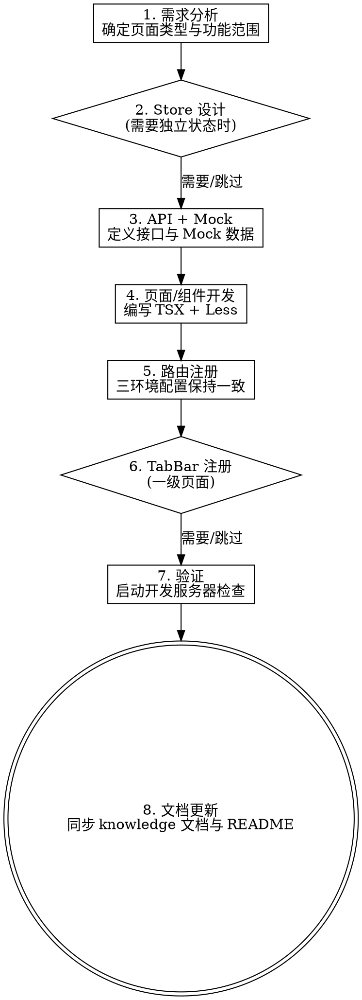

# H5 Micro-Tools 开发流程

标准化的 H5 页面与功能开发技能，覆盖从需求分析到验证完成的全流程。适用于 `super-tools-web/packages/h5/micro-tools` 项目（React 16 + UmiJS 3 + Zustand + TypeScript + Less）。

## When to Use

- 新增 H5 页面（一级页面 / 二级页面）
- 新增或修改项目级公共组件
- 新增 API 接口与 Mock 数据
- 新增或修改 Zustand Store
- 修复 H5 页面 Bug 或样式问题

**When NOT to use：**
- shared 层公共组件/工具的开发（不在 micro-tools 范围）
- Node.js 后端接口开发（使用 `node-api-dev` skill）
- 非 micro-tools 子项目的 H5 开发

## Process Flow



## Checklist

你必须为以下每个适用阶段创建 TODO，并按顺序完成：

1. **需求分析** — 确定页面类型（一级/二级）、功能范围、涉及模块
2. **Store 设计** — 创建 Zustand Store（如需独立状态管理）
3. **API 与 Mock** — 在 `service.ts` + `mock/index.ts` 添加接口
4. **页面/组件开发** — 编写 TSX 组件 + Less 样式
5. **路由注册** — 在三个环境配置中注册路由
6. **TabBar 注册** — 一级页面需注册底部导航 + KeepAlive 缓存
7. **验证** — 启动开发服务器，确认功能正常
8. **文档更新** — 同步更新 knowledge 文档与 README.md

---

## 项目架构速查

```
super-tools-web/
├── packages/shared/          ← 公共共享层
└── packages/h5/micro-tools/  ← 本项目
    ├── .umirc.ts             # 基础配置（alias、base、publicPath）
    ├── .umirc.dev.ts         # 开发环境（路由、代理、Mock）
    ├── .umirc.preview.ts     # 预发布环境配置
    ├── .umirc.prod.ts        # 生产环境配置
    ├── service.ts            # API 请求层（统一出口）
    ├── assets/variables.less # CSS 全局变量（设计 token）
    ├── components/           # 项目私有公共组件
    ├── constants/            # 常量（TAB_BAR_ITEMS 等）
    ├── hooks/                # 项目 Hooks
    ├── store/                # Zustand 状态管理
    ├── layouts/              # 路由布局
    ├── mock/                 # Mock 数据（开发环境）
    └── pages/                # 页面组件
```

### 别名映射

| 别名 | 实际路径 |
|------|---------|
| `@/utils` | `packages/shared/utils` |
| `@/hooks` | `packages/shared/hooks` |
| `@/components` | `packages/shared/components` |
| `@/appsdk` | `packages/shared/appsdk` |
| `@/constants` | `packages/shared/constants` |
| `@/contexts` | `packages/shared/contexts` |
| `@/assets` | `packages/h5/micro-tools/assets` |

---

## 阶段一：需求分析

**目标**：明确开发范围和页面类型。

**一级页面特征**（含底部导航栏，KeepAlive 缓存）：

| 页面 | 路径 | 文件 |
|------|------|------|
| 首页 | `/` | `pages/home/` |
| 收藏 | `/favorites` | `pages/favorites/` |
| 特色 | `/featured` | `pages/featured/` |
| 网站 | `/sites` | `pages/sites/` |
| 我的 | `/mine` | `pages/mine/` |

**二级页面特征**（含返回按钮，无底部导航栏）：搜索、登录、设置、个人信息、会员、帮助、关于等。

**需确认的事项**：
- 页面类型：一级（TabBar）还是二级（返回按钮）
- 是否需要独立 Store
- 涉及哪些 API 接口
- 是否需要新组件
- 与哪些已有模块交互

---

## 阶段二：Store 设计

> 如不需要独立状态管理，可跳过此阶段。

**文件位置**：`store/{name}.ts`，命名 `camelCase`。

**Store 模板**：

```typescript
import { create } from 'zustand';
import { immer } from 'zustand/middleware/immer';

// 1. State 接口
interface XxxState {
  list: any[];
  loading: boolean;
  error: string | null;
}

// 2. Actions 接口
interface XxxActions {
  fetchList: () => Promise<void>;
  reset: () => void;
}

// 3. 初始状态
const initialState: XxxState = {
  list: [],
  loading: false,
  error: null,
};

// 4. 创建 Store
export const useXxxStore = create<XxxState & XxxActions>()(
  immer(set => ({
    ...initialState,

    fetchList: async () => {
      set(state => { state.loading = true; state.error = null; });
      try {
        const data = await someApiCall();
        set(state => { state.list = data || []; state.loading = false; });
      } catch (e: any) {
        set(state => { state.error = e.message; state.loading = false; });
      }
    },

    reset: () => {
      set(() => ({ ...initialState }));
    },
  })),
);
```

**关键规范**：

- 使用 `create` + `immer` 中间件
- State 接口和 Actions 接口分离
- 必须提供 `reset()` 方法
- immer 中直接修改 state（`state.xxx = yyy`），不返回新对象
- 异步操作直接 `async/await`
- 需持久化的状态手动写 `localStorage`
- 从 `store/index.ts` 统一导出

**导出注册**（`store/index.ts`）：

```typescript
export { useXxxStore } from './xxx';
```

---

## 阶段三：API 与 Mock

### 3.1 在 service.ts 中添加接口

```typescript
import { request } from '@/utils';

// 响应解包
const unwrap = async <T>(promise: Promise<ApiResponse<T>>): Promise<T | null> => {
  const res = await promise;
  return res.code === 0 ? res.data : null;
};

// 新增接口函数
export const getXxxList = () =>
  unwrap<XxxItem[]>(request('/api/xxx/list'));

export const createXxx = (data: CreateXxxParams) =>
  unwrap<boolean>(request('/api/xxx/create', { method: 'POST', data }));
```

### 3.2 在 mock/index.ts 中添加 Mock

```typescript
export default {
  'GET /api/xxx/list': (req: any, res: any) => {
    res.json({
      code: 0,
      data: [
        { id: '1', name: '示例', /* ... */ },
      ],
    });
  },

  'POST /api/xxx/create': (req: any, res: any) => {
    const { name } = req.body;
    res.json({ code: 0, data: true });
  },
};
```

**响应格式约定**：

```typescript
interface ApiResponse<T = any> {
  code: number;       // 0 = 成功
  data: T;
  message?: string;   // code 非 0 时的错误信息
}
```

---

## 阶段四：页面/组件开发

### 4.1 一级页面模板

```tsx
import React, { useEffect } from 'react';
import { useHistory } from 'umi';
import { useGlobalStore } from '../../store';
import AppHeader from '../../components/AppHeader';
import AppTabBar from '../../components/AppTabBar';
import { TAB_BAR_ITEMS } from '../../constants';
import './index.less';

const NewPage: React.FC = () => {
  const { tabBarMode, activeTabBarKey, setActiveTabBarKey } = useGlobalStore();
  const history = useHistory();

  return (
    <div className="page-new">
      <AppHeader
        title="新页面"
        buttons={[
          { type: 'agent' },
          { type: 'search', onClick: () => history.push('/search') },
          { type: 'settings' },
        ]}
      />

      <main className="page-new__content">
        {/* 页面内容 */}
      </main>

      <AppTabBar
        mode={tabBarMode}
        activeKey={activeTabBarKey}
        items={TAB_BAR_ITEMS}
        onChange={key => {
          setActiveTabBarKey(key);
          history.push(key === 'home' ? '/' : `/${key}`);
        }}
      />
    </div>
  );
};

export default NewPage;
```

### 4.2 二级页面模板

```tsx
import React from 'react';
import { history } from 'umi';
import AppHeader from '../../components/AppHeader';
import './index.less';

const NewSubPage: React.FC = () => {
  return (
    <div className="page-new-sub">
      <AppHeader
        title="新二级页面"
        showBack
        onBack={() => history.goBack()}
      />

      <main className="page-new-sub__content">
        {/* 页面内容 */}
      </main>
    </div>
  );
};

export default NewSubPage;
```

### 4.3 样式模板

```less
@import '~@/assets/variables.less';

.page-new {
  min-height: 100vh;
  background: var(--bg-page);

  &__content {
    padding-top: var(--header-height);
    padding-left: var(--spacing-md);
    padding-right: var(--spacing-md);
    min-height: calc(100vh - var(--header-height));
  }
}
```

### 4.4 组件开发模板

**目录结构**：

```
components/
└── MyComponent/
    ├── index.tsx
    └── MyComponent.less
```

**组件代码**：

```tsx
import React, { FC } from 'react';
import classnames from 'classnames';
import './MyComponent.less';

export interface MyComponentProps {
  /** 属性说明 */
  title: string;
}

const MyComponent: FC<MyComponentProps> = ({ title }) => {
  return (
    <div className="my-component">
      <span className="my-component__title">{title}</span>
    </div>
  );
};

export default MyComponent;
```

**组件导出**（`components/index.ts`）：

```typescript
export { default as MyComponent } from './MyComponent';
export type { MyComponentProps } from './MyComponent';
```

### 4.5 页面布局结构

**一级页面**：

```
┌──────────────────────┐
│ AppHeader (fixed)    │ ← --header-height (88px)
├──────────────────────┤
│ AppTabs (可选)       │ ← --tabs-height (80px)
├──────────────────────┤
│ 主体内容区 (scroll)   │ ← 自适应
├──────────────────────┤
│ AppTabBar            │ ← float: 悬浮 / flat: 占据空间
└──────────────────────┘
```

**二级页面**：

```
┌──────────────────────┐
│ AppHeader (showBack) │ ← --header-height (88px)
├──────────────────────┤
│ 主体内容区 (scroll)   │ ← 100vh - header
└──────────────────────┘
```

---

## 阶段五：路由注册

在以下 **三个** 配置文件中添加路由（必须保持一致）：

- `.umirc.dev.ts`
- `.umirc.preview.ts`
- `.umirc.prod.ts`

```typescript
routes: [
  {
    exact: false,
    path: '/',
    component: '@/layouts',
    routes: [
      // ... 已有路由
      { path: '/new-page', component: '@/pages/new-page', title: '新页面' },
    ],
  },
]
```

**URL 前缀**：

| 环境 | base |
|------|------|
| 开发 | `/fe/h5/micro-tools/` |
| 预发布 | `/fepreview/h5/micro-tools/` |
| 生产 | `/fe/h5/micro-tools/` |

---

## 阶段六：TabBar 注册

> 仅一级页面需要，二级页面跳过此阶段。

**步骤 1**：在 `constants/index.ts` 的 `TAB_BAR_ITEMS` 中添加导航项：

```typescript
export const TAB_BAR_ITEMS = [
  // ... 已有项
  { key: 'new-page', name: '新页面', icon: 'icon-url', activeIcon: 'active-icon-url' },
];
```

**步骤 2**：在 `components/KeepAlive/CacheRoute.tsx` 的 `CACHE_ROUTES` 中添加缓存路由路径。

---

## 阶段七：验证

```bash
# 启动开发服务器
yarn start h5/micro-tools
```

**验证清单**：

- [ ] 页面可正常访问（`http://localhost:8000/fe/h5/micro-tools/{path}`）
- [ ] 组件渲染正确，无控制台报错
- [ ] Mock 数据正常返回
- [ ] 样式符合设计稿（750px 基准，px 自动转 rem）
- [ ] 一级页面：TabBar 切换正常，KeepAlive 缓存生效
- [ ] 二级页面：返回按钮功能正常
- [ ] 主题色跟随 CSS 变量

---

## 阶段八：文档更新

> 验证通过后，**必须**同步更新相关的 knowledge 文档和 README.md，确保文档与代码始终保持一致。

**文档位置**：

| 文档 | 路径 | 职责 |
|------|------|------|
| 页面开发指南 | `docs/knowledge/页面开发指南.md` | 页面分类表、页面结构模板、KeepAlive 缓存路由 |
| API 接口文档 | `docs/knowledge/API接口文档.md` | 接口定义、请求/响应格式、数据模型 |
| 状态管理文档 | `docs/knowledge/状态管理文档.md` | Store 架构、State/Actions 定义、使用示例 |
| 组件使用文档 | `docs/knowledge/组件使用文档.md` | 组件 API、Props 说明、使用示例 |
| 开发规范与常见问题 | `docs/knowledge/开发规范与常见问题.md` | 编码规范、常见错误、FAQ |
| README.md | `README.md` | 项目总览、目录结构、路由总览、状态管理总览 |

### 8.1 判断需要更新哪些文档

根据本次开发涉及的内容，对照以下清单确定需要更新的文档：

| 本次开发涉及 | 需要更新的文档 |
|-------------|---------------|
| 新增/修改**页面** | `页面开发指南.md` + `README.md`（路由总览 + 目录结构） |
| 新增/修改 **API 接口** | `API接口文档.md` + `README.md`（如涉及新数据模型） |
| 新增/修改 **Store** | `状态管理文档.md` + `README.md`（状态管理总览表） |
| 新增/修改**公共组件** | `组件使用文档.md` + `README.md`（核心组件表 + 目录结构） |
| 新增/修改 **Hook** | `开发规范与常见问题.md` 或 `组件使用文档.md`（视 Hook 性质） |
| 修改**开发规范/新增常见问题** | `开发规范与常见问题.md` |

### 8.2 knowledge 文档更新规范

每份 knowledge 文档遵循统一格式，更新时需遵守：

1. **保持文档头部元信息不变**：每份文档开头的 `> **适用范围**` 和 `> **最后更新**` 保持格式一致
2. **更新日期**：将 `> **最后更新**` 修改为当天日期（格式：`YYYY-MM-DD`）
3. **按已有章节结构追加**：在对应章节中按已有格式增量追加，而非重写整个文档
4. **保持表格格式一致**：新增行需与已有表格列对齐

**各文档具体更新要点**：

#### 页面开发指南.md

- 在"一级页面"或"二级页面"表格中追加新页面行（路径、组件名、文件位置）
- 如涉及新的页面模板模式，在对应章节补充说明

#### API接口文档.md

- 在对应模块章节中追加新接口定义（方法、路径、请求参数、响应数据）
- 如新增接口模块，按已有模块格式新建章节
- 补充数据模型（TypeScript 接口定义）

#### 状态管理文档.md

- 在 Store 架构章节更新 Store 列表
- 为新 Store 添加完整的章节：State 接口、Actions 接口、使用示例
- 如修改已有 Store，更新对应的 State/Actions 说明

#### 组件使用文档.md

- 在"组件总览"表格中追加新组件行
- 为新组件添加完整章节：功能描述、Props API 表格、使用示例、注意事项
- 如修改已有组件 Props，更新对应 API 表格

#### 开发规范与常见问题.md

- 如发现新的常见错误模式，追加到"常见问题"章节
- 如涉及新的规范约定，在对应规范章节补充

### 8.3 README.md 更新规范

README.md 是项目的总入口文档，更新时重点关注以下区域：

#### 目录结构（📁 目录结构）

- 新增页面：在 `pages/` 区域追加注释行（如 `│   ├── new-page/          # 二级 — 新页面`）
- 新增组件：在 `components/` 区域追加注释行
- 新增 Store：在 `store/` 区域追加注释行
- 新增 Hook：在 `hooks/` 区域追加注释行

#### 路由总览（🗺️ 路由总览）

- 在"一级页面"或"二级页面"表格中追加新路由行（路由、页面、说明）

#### 核心组件（🧩 核心组件）

- 新增公共组件时，在组件表格中追加行

#### 状态管理（📦 状态管理）

- 新增 Store 时，在 Store 表格中追加行（Store 名、文件、职责）

#### 维护指引（📝 维护指引）

- 如本次开发引入了新的维护模式或注意事项，在对应指引中补充

### 8.4 文档更新检查清单

- [ ] 所有涉及的 knowledge 文档已更新
- [ ] knowledge 文档的 `最后更新` 日期已刷新为当天
- [ ] README.md 的目录结构已反映新增文件
- [ ] README.md 的路由总览已包含新增路由
- [ ] README.md 的组件/Store 表格已同步更新
- [ ] 文档中的代码示例与实际代码一致
- [ ] 文档格式与已有内容风格保持一致（表格对齐、代码块语言标注等）

---

## Quick Reference

### 可用公共组件

| 组件 | 用途 | 关键 Props |
|------|------|-----------|
| `AppHeader` | 头部导航 | `title`, `buttons?`, `showBack?`, `onBack?` |
| `AppTabs` | Tab 切换 | `mode: 'double'|'multiple'`, `tabs`, `activeIndex`, `onChange` |
| `AppTabBar` | 底部导航栏 | `mode: 'float'|'flat'`, `activeKey`, `items`, `onChange` |
| `AppModal` | 底部弹窗 | `visible`, `title?`, `content?`, `onClose?`, `onConfirm?` |
| `KeepAlive` | 页面缓存 | 在 Layout 中集成，无需手动使用 |

### AppHeader 按钮类型

| 类型 | 用途 |
|------|------|
| `search` | 搜索（搜索框不可见时显示） |
| `agent` | 智能体入口（预留） |
| `settings` | 弹出设置面板 |
| `sort` | 弹出排序选项 |
| `add` | 添加收藏/跳转 |
| `scan` | 调用 AppSdk 扫码 |
| `placeholder` | 占位，维持布局 |

### Store 速查

| Store | Hook | 职责 |
|-------|------|------|
| 全局设置 | `useGlobalStore` | 主题色、导航模式、列表模式（localStorage 持久化） |
| 首页 | `useHomeStore` | Banner + 工具分类列表 |
| 收藏 | `useFavoritesStore` | 收藏工具列表与增删 |
| 网站 | `useSitesStore` | 网站分类 Tab + 网站列表 |
| 用户 | `useUserStore` | 登录态、用户信息、会员状态 |

### CSS 变量速查

| 变量 | 值 | 用途 |
|------|---|------|
| `--header-height` | 88px | 头部导航高度 |
| `--tabs-height` | 80px | Tab 栏高度 |
| `--tabbar-height` | 100px | 底部导航高度 |
| `--primary-color` | #1677ff | 主题色（动态可改） |
| `--spacing-xs` ~ `--spacing-xxl` | 4px~48px | 间距体系 |
| `--border-radius-sm` ~ `--border-radius-round` | 8px~999px | 圆角 |
| `--glass-bg` / `--glass-blur` | — | 毛玻璃效果 |
| `--text-primary` / `--text-secondary` / `--text-tertiary` | — | 文字色 |

### useSwipe 滑动手势 Hook

```tsx
const swipeHandlers = useSwipe({
  threshold: 50,
  velocityThreshold: 0.3,
  onSwipeLeft: () => handleNext(),
  onSwipeRight: () => handlePrev(),
  onSwiping: (offsetX) => setOffset(offsetX),
  onSwipeEnd: () => setOffset(0),
});

<main {...swipeHandlers}>{/* 内容 */}</main>
```

### 常用命令

| 命令 | 用途 |
|------|------|
| `yarn start h5/micro-tools` | 启动开发服务器 |
| `yarn build-prod h5/micro-tools` | 生产构建 |
| `yarn build-preview h5/micro-tools` | 预发布构建 |
| `yarn workspace h5-micro-tools add <pkg>` | 添加项目依赖 |

---

## Common Mistakes

| 错误 | 正确做法 |
|------|---------|
| 样式硬编码颜色/间距 | 必须使用 CSS 变量（`var(--primary-color)`） |
| 忘记导入 variables.less | 每个 `.less` 文件开头 `@import '~@/assets/variables.less'` |
| 路由只在一个配置文件中注册 | 三个环境配置（dev/preview/prod）必须保持一致 |
| 一级页面用 `history.push` 切换 | 一级页面间通过 `AppTabBar` 组件切换 |
| 二级页面用 `history.push` 回一级页面 | 二级页面返回用 `history.goBack()` |
| immer 中返回新对象 | 直接修改 state：`state.xxx = yyy` |
| KeepAlive 页面在 `useEffect([], [])` 做初始化 | 用 `useKeepAliveActivation` 监听激活事件 |
| px 值除以 2 写 | 直接写 750px 设计稿标注值，postcss-pxtorem 自动转换 |
| 忘记注册 KeepAlive 缓存路由 | 一级页面需在 `CACHE_ROUTES` 中添加路径 |
| 组件不从 `components/index.ts` 导出 | 所有公共组件必须统一导出 |
| 安装最新版 PostCSS 插件 | UmiJS 3 内置 PostCSS 7，必须用对应版本（autoprefixer v9、postcss-pxtorem v5） |
| Store 没有 `reset()` 方法 | 每个 Store 必须提供 `reset()` 恢复初始状态 |
| 开发完成后不更新文档 | 验证通过后必须同步更新 knowledge 文档和 README.md（阶段八） |
