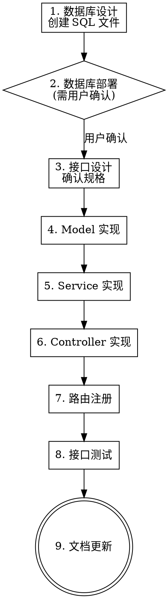

# Node.js API 接口开发流程

标准化的 API 接口全链路开发技能，覆盖从数据库设计到文档更新的 9 个阶段。适用于 super-tool-node 项目（Egg.js 3.x + TypeScript 5.x + Sequelize + MySQL）。

<HARD-GATE>
阶段 2（数据库部署）涉及数据库写入操作，必须获得用户明确确认后方可执行。未经确认不得执行任何数据库变更命令。
</HARD-GATE>

## Checklist

你必须为以下每个阶段创建 TODO，并按顺序完成：

1. **数据库设计** — 创建 SQL 文件
2. **数据库部署** — 执行 SQL（⚠️ 需用户确认）
3. **接口设计** — 确认接口规格
4. **数据模型层** — 实现 Sequelize Model
5. **业务逻辑层** — 实现 Service
6. **控制层** — 实现 Controller
7. **路由注册** — 注册路由
8. **接口测试** — 编写并运行测试
9. **文档更新** — 生成/更新 API 文档

## Process Flow



---

## 阶段一：数据库设计

**目标**：在 `database/` 目录下创建可执行的 SQL 文件。

**命名规范**：`{序号}_{功能描述}.sql`（如 `002_add_product_table.sql`）

**必须遵循的约定**：

- `CREATE TABLE IF NOT EXISTS` 防止重复执行报错
- 字段命名 `snake_case`
- 必含字段：`id`（主键）、`created_at`、`updated_at`
- 软删除加 `deleted_at` 字段
- 字符集 `utf8mb4`，排序 `utf8mb4_unicode_ci`

**SQL 模板**：

```sql
-- 功能描述：xxx 表
-- 创建时间：YYYY-MM-DD

CREATE TABLE IF NOT EXISTS `{table_name}` (
  `id`         INT UNSIGNED    NOT NULL AUTO_INCREMENT COMMENT '主键',
  -- 业务字段...
  `status`     TINYINT UNSIGNED NOT NULL DEFAULT 1     COMMENT '状态: 1=启用 0=禁用',
  `created_at` DATETIME        NOT NULL DEFAULT CURRENT_TIMESTAMP COMMENT '创建时间',
  `updated_at` DATETIME        NOT NULL DEFAULT CURRENT_TIMESTAMP ON UPDATE CURRENT_TIMESTAMP COMMENT '更新时间',
  `deleted_at` DATETIME                 DEFAULT NULL   COMMENT '软删除时间',
  PRIMARY KEY (`id`),
  -- 索引...
) ENGINE=InnoDB DEFAULT CHARSET=utf8mb4 COLLATE=utf8mb4_unicode_ci COMMENT='表注释';
```

**完成标准**：SQL 文件已创建，语法正确，字段完整。

---

## 阶段二：数据库部署

<HARD-GATE>
⚠️ 此阶段涉及数据库写入操作，必须向用户展示将要执行的 SQL 内容，并获得明确确认后方可执行。
</HARD-GATE>

**操作步骤**：

1. 向用户展示 SQL 文件内容，请求确认
2. 获得确认后，运行数据库交互脚本：
   ```bash
   npm run db:cli
   ```
3. 在交互界面中：
   - `\l` — 列出所有 SQL 文件，确认目标文件存在
   - `\r <序号>` — 执行对应 SQL 文件（脚本会二次确认）
   - `\d` — 查看数据表，确认表已创建
4. 如果不需要新建表（复用已有表），跳过此阶段

**完成标准**：数据表已在数据库中创建成功，或确认复用已有表。

---

## 阶段三：接口设计

**目标**：明确待开发接口的完整规格。

**需确认的规格项**：

| 规格项           | 说明                                  |
| ---------------- | ------------------------------------- |
| HTTP 方法 + 路径 | 如 `POST /api/products`，RESTful 风格 |
| 认证要求         | 是否需要 `auth` 中间件                |
| 路径参数         | 如 `/:id`，类型与约束                 |
| Query 参数       | 分页、筛选、排序                      |
| 请求体 (Body)    | 字段名、类型、必填、校验规则          |
| 成功响应         | HTTP 状态码（200/201）、`data` 结构   |
| 错误场景         | 400/401/403/404/422/500 及 message    |

**统一响应格式**：

```json
{
	"code": 200,
	"message": "success",
	"data": {},
	"timestamp": 1712000000000
}
```

**错误码规范**：定义在 `app/constants/errorCodes.ts`，格式 `1xxxxx`。新模块需新增对应错误码区间。

**完成标准**：所有接口规格已确认，错误码已定义（如需新增）。

---

## 阶段四：数据模型层实现

**目标**：在 `app/model/` 下实现 Sequelize Model。

**判断原则**：

- 已有 Model → 直接复用，跳过此阶段
- 新建表 → 创建对应 Model 文件

**Model 模板**（`app/model/{name}.ts`）：

```typescript
import { Application } from 'egg';
import { DataTypes, Optional } from 'sequelize';

export interface {Name}Attributes {
  id: number;
  uuid: string;
  // 业务字段...
  status: number;
  createdAt?: Date;
  updatedAt?: Date;
  deletedAt?: Date;
}

export interface {Name}CreationAttributes
  extends Optional<{Name}Attributes, 'id' | 'status'> {}

export default (app: Application) => {
  const { STRING, INTEGER, TINYINT, DATE, UUID, UUIDV4 } = DataTypes;

  const {Name} = app.model.define('{Name}', {
    id:     { type: INTEGER.UNSIGNED, autoIncrement: true, primaryKey: true },
    uuid:   { type: UUID, defaultValue: UUIDV4, allowNull: false, unique: true },
    // 业务字段...
    status: { type: TINYINT.UNSIGNED, defaultValue: 1 },
  }, {
    tableName: '{table_name}',
    paranoid: true,
    timestamps: true,
    underscored: true,
  });

  // 关联关系（如有）
  // ({Name} as any).associate = () => { ... };

  return {Name};
};
```

**关键约定**：

- 属性名 `camelCase`，多词属性通过 `field: 'snake_case'` 映射
- `underscored: true` 自动处理 `createdAt` → `created_at`
- 软删除表必须 `paranoid: true`
- 导出接口 `{Name}Attributes` 和 `{Name}CreationAttributes`

**完成标准**：Model 文件已创建，接口定义完整，字段与数据库表一一对应。

---

## 阶段五：业务逻辑层实现

**目标**：在 `app/service/` 下实现 Service。

**Service 模板**（`app/service/{name}.ts`）：

```typescript
import BaseService, { PaginationResult } from './base';

export default class {Name}Service extends BaseService {

  async create(dto: any) {
    // 1. 唯一性校验（如有）
    // 2. 创建记录
    const record = await this.ctx.model.{Name}.create(dto as any);
    return (record as any).toJSON();
  }

  async findById(id: number) {
    const record = await this.ctx.model.{Name}.findByPk(id);
    if (!record) this.ctx.throw(404, '{资源名}不存在');
    return (record as any).toJSON();
  }

  async findList(query: any): Promise<PaginationResult<any>> {
    const { keyword, status, ...pagination } = query;
    const { Op } = require('sequelize');
    const where: any = {};
    if (keyword) where.name = { [Op.like]: `%${keyword}%` };
    if (status !== undefined) where.status = status;
    return this.paginate(this.ctx.model.{Name}, { where }, pagination);
  }

  async update(id: number, dto: any) {
    const record = await this.ctx.model.{Name}.findByPk(id);
    if (!record) this.ctx.throw(404, '{资源名}不存在');
    await (record as any).update(dto);
    return (record as any).toJSON();
  }

  async delete(id: number) {
    const record = await this.ctx.model.{Name}.findByPk(id);
    if (!record) this.ctx.throw(404, '{资源名}不存在');
    await (record as any).destroy();
  }
}
```

**关键约定**：

- 继承 `BaseService`（`app/service/base.ts`）
- 分页查询使用 `this.paginate(model, options, pagination)`
- 缓存读取 `this.getOrSetCache(key, fetchFn, ttl)`，写操作后 `this.clearCache(pattern)`
- 业务异常通过 `this.ctx.throw(httpCode, message)` 抛出
- Redis 不可用时 `getOrSetCache` 自动降级到数据库

**完成标准**：Service 方法已实现，覆盖所有接口设计中的业务逻辑。

---

## 阶段六：控制层实现

**目标**：在 `app/controller/` 下实现 Controller。

**Controller 模板**（`app/controller/{name}.ts` 或 `app/controller/admin/{name}.ts`）：

```typescript
import BaseController from './base';  // 管理端: '../base'

export default class {Name}Controller extends BaseController {

  /** GET /api/{resources} */
  async index() {
    const pagination = this.getPagination();
    const { keyword, status } = this.ctx.query;
    const result = await this.service.{name}.findList({
      ...pagination,
      keyword,
      status: status !== undefined ? Number(status) : undefined,
    });
    this.paginated(result);
  }

  /** GET /api/{resources}/:id */
  async show() {
    const record = await this.service.{name}.findById(Number(this.ctx.params.id));
    this.success(record);
  }

  /** POST /api/{resources} */
  async create() {
    this.validate({ name: { type: 'string' } }); // 按需定义校验规则
    const record = await this.service.{name}.create(this.ctx.request.body);
    this.created(record);
  }

  /** PUT /api/{resources}/:id */
  async update() {
    const record = await this.service.{name}.update(
      Number(this.ctx.params.id),
      this.ctx.request.body,
    );
    this.success(record, '更新成功');
  }

  /** DELETE /api/{resources}/:id */
  async destroy() {
    await this.service.{name}.delete(Number(this.ctx.params.id));
    this.success(null, '删除成功');
  }
}
```

**关键约定**：

- 继承 `BaseController`（`app/controller/base.ts`）
- 响应方法：`this.success(data, msg)`、`this.created(data, msg)`、`this.paginated(result, msg)`
- 参数校验：`this.validate(rules)`，失败自动返回 422
- 分页参数：`this.getPagination()` → `{ page, pageSize }`
- Controller 只负责参数提取和响应格式化，业务逻辑下沉到 Service

**完成标准**：Controller 方法已实现，参数校验完整，响应格式统一。

---

## 阶段七：路由注册

**目标**：在 `app/router.ts` 中注册新接口路由。

**操作步骤**：

在 `app/router.ts` 对应注释分区下添加路由：

```typescript
// ==================== {模块名} ====================
router.get('/api/{resources}',        auth, controller.{name}.index);
router.get('/api/{resources}/:id',    auth, controller.{name}.show);
router.post('/api/{resources}',       auth, controller.{name}.create);
router.put('/api/{resources}/:id',    auth, controller.{name}.update);
router.delete('/api/{resources}/:id', auth, controller.{name}.destroy);
```

**关键约定**：

- 需认证的接口必须加 `auth` 中间件
- 精确路径（`/api/auth/login`）放在通配路径（`/api/auth/:id`）之前
- 管理端接口使用 `/api/admin/` 前缀，控制器路径为 `controller.admin.{name}.xxx`

**完成标准**：路由已注册，路径和中间件配置正确。

---

## 阶段八：接口测试

**目标**：编写并运行接口测试。

**操作步骤**：

1. 运行测试交互脚本：

   ```bash
   npm run api
   ```

   即 `node scripts/api-test-interactive.js`

2. 如果是全新模块，在脚本的 `MODULES` 配置中添加：

   ```javascript
   {name}: {
     label:       '{模块显示名}',
     ctrlFiles:   ['{name}.ts'],
     testFile:    'api/{name}.test.ts',
     routePrefix: '/api/{resources}',
     docsDir:     '{name}',
   }
   ```

3. 选择对应模块 → **选项 3（同步测试文件）** 自动生成测试骨架
4. 完善测试骨架中的请求体和断言
5. 选择对应模块 → **选项 1（运行测试）** 执行测试

**测试文件模板**（`test/api/{name}.test.ts`）：

```typescript
import * as assert from 'assert';
import { app } from 'egg-mock/bootstrap';

describe('{模块名} API', () => {
	let adminToken: string;

	before(async () => {
		const res = await app.httpRequest().post('/api/auth/login').send({
			username: 'admin',
			password: 'Admin@123456',
			clientId: 'web',
			clientSecret: 'secret',
		});
		adminToken = res.body.data?.accessToken;
	});

	it('POST /api/{resources} - 创建成功', async () => {
		const res = await app
			.httpRequest()
			.post('/api/{resources}')
			.set('Authorization', `Bearer ${adminToken}`)
			.send({
				/* 请求体 */
			});
		assert.strictEqual(res.status, 201);
		assert.ok(res.body.data?.id);
	});

	// 更多测试用例...
});
```

**完成标准**：测试用例覆盖所有接口，全部通过。

---

## 阶段九：文档总结更新

**目标**：更新 API 文档和相关文档。

**操作步骤**：

1. **自动生成 API 文档**：在测试脚本中选择模块 → **选项 2（生成/更新 API 文档）** → 输出到 `docs/api/{module}/README.md`
2. **更新全局索引**：主菜单 → **选项 3（生成全部模块 API 文档）** → 更新 `docs/api/README.md`
3. **更新数据库文档**（如新建表）：在 `docs/database/` 下补充表结构说明
4. **记录变更日志**：在 `docs/changelog/YYYY-MM.md` 中记录本次变更

**完成标准**：API 文档已生成，全局索引已更新，变更已记录。

---

## Quick Reference

### 项目目录结构

```
super-tool-node/
├── database/                    # SQL 文件（阶段 1-2）
├── app/
│   ├── model/                   # Sequelize Model（阶段 4）
│   ├── service/                 # 业务逻辑层（阶段 5）
│   │   └── base.ts              # BaseService: paginate / getOrSetCache / clearCache
│   ├── controller/              # 控制层（阶段 6）
│   │   ├── base.ts              # BaseController: success / created / paginated / validate
│   │   └── admin/               # 管理端控制器
│   ├── constants/errorCodes.ts  # 统一错误码
│   └── router.ts                # 路由注册（阶段 7）
├── test/api/                    # 接口测试（阶段 8）
├── scripts/
│   ├── db-cli.js                # 数据库 CLI → npm run db:cli
│   └── api-test-interactive.js  # API 测试系统 → npm run api
└── docs/api/                    # API 文档（阶段 9）
```

### 常用命令

| 命令             | 用途                                                  |
| ---------------- | ----------------------------------------------------- |
| `npm run db:cli` | 数据库交互 CLI（`\l` 列出 / `\r N` 执行 / `\d` 查表） |
| `npm run api`    | API 测试交互系统（测试/文档/同步）                    |
| `npm run dev`    | 启动开发服务器                                        |
| `npm test`       | 运行全部测试                                          |

### BaseService 方法速查

| 方法            | 签名                                      | 说明                                                         |
| --------------- | ----------------------------------------- | ------------------------------------------------------------ |
| `paginate`      | `paginate<T>(model, options, pagination)` | 分页查询，返回 `{ list, total, page, pageSize, totalPages }` |
| `getOrSetCache` | `getOrSetCache<T>(key, fetchFn, ttl=300)` | Redis 缓存读取，不可用时降级                                 |
| `clearCache`    | `clearCache(pattern)`                     | 按模式清除 Redis 缓存                                        |

### BaseController 方法速查

| 方法            | 签名                                   | 说明                              |
| --------------- | -------------------------------------- | --------------------------------- |
| `success`       | `success(data?, message='success')`    | 200 成功响应                      |
| `created`       | `created(data?, message='创建成功')`   | 201 创建成功                      |
| `paginated`     | `paginated(result, message='success')` | 200 分页响应                      |
| `validate`      | `validate(rules)`                      | 参数校验，失败抛 422              |
| `getPagination` | `getPagination()`                      | 提取分页参数 `{ page, pageSize }` |

### 错误码区间规划

| 区间      | 模块           |
| --------- | -------------- |
| `1001xx`  | 认证错误       |
| `1002xx`  | 用户错误       |
| `1003xx`  | 角色/权限错误  |
| `1004xx+` | 新模块按序递增 |

## Common Mistakes

| 错误                       | 正确做法                              |
| -------------------------- | ------------------------------------- |
| Model 属性名用 snake_case  | 属性名用 camelCase，通过 `field` 映射 |
| 忘记设置 `paranoid: true`  | 有 `deleted_at` 的表必须设置          |
| Controller 中写业务逻辑    | 业务逻辑下沉到 Service                |
| 路由未加 `auth` 中间件     | 需认证接口必须加 auth                 |
| 直接操作 Redis 不做降级    | 使用 `getOrSetCache` 自动降级         |
| 未定义接口类型就开始编码   | 先完成阶段 3 接口设计再动手           |
| 未执行数据库部署就写 Model | 严格按阶段顺序执行                    |
