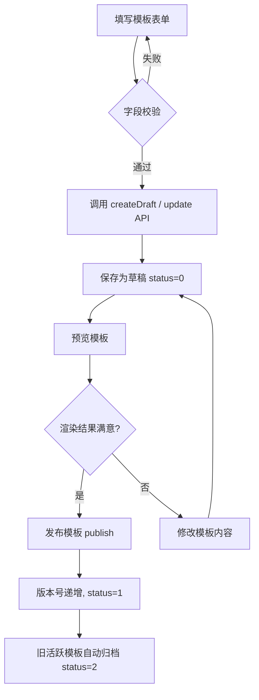
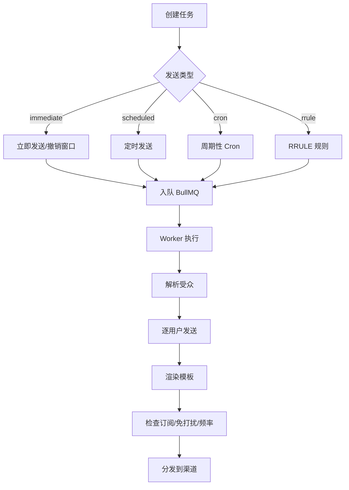
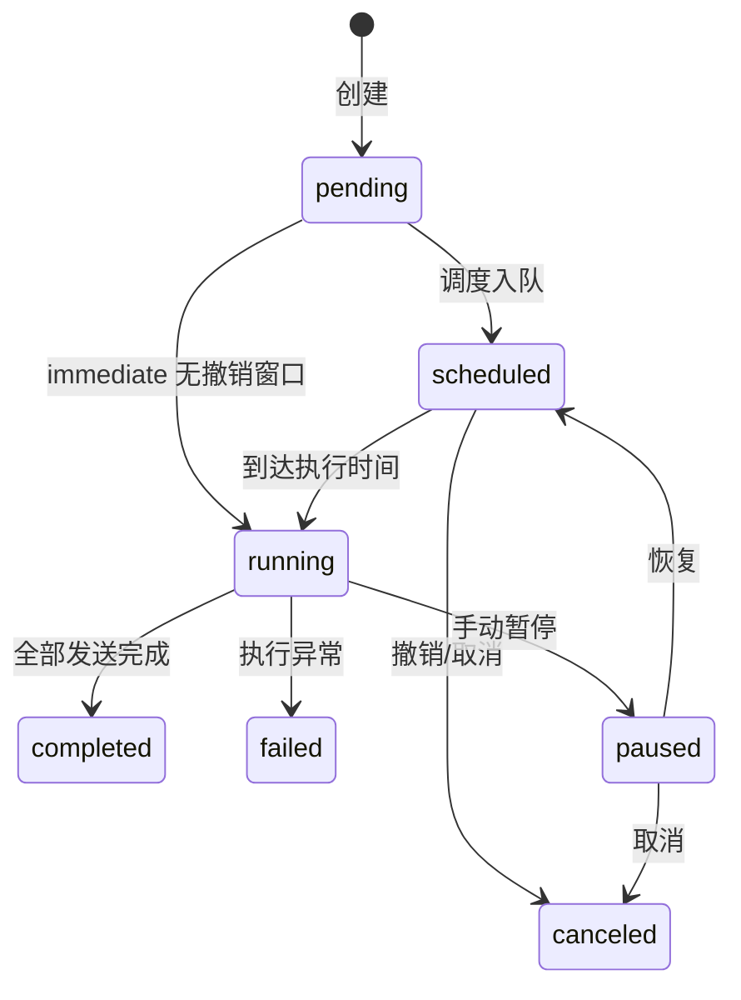

# 通知推送系统使用指南

> 本文档面向开发人员，详细说明通知推送系统的模板编辑、发送任务创建、受众配置等核心功能的使用方法和配置示例。

---

## 目录

1. [模板编辑配置](#1-模板编辑配置)
2. [创建发送任务](#2-创建发送任务)
3. [受众配置](#3-受众配置)
4. [API 接口参考](#4-api-接口参考)

---

## 1. 模板编辑配置

### 1.1 模板字段说明

| 字段              | 类型   | 必填 | 说明                                                     |
| ----------------- | ------ | ---- | -------------------------------------------------------- |
| `typeId`          | number | ✅   | 关联的通知类型 ID                                        |
| `code`            | string | ✅   | 模板唯一编码（同一 code + channel 下版本递增）           |
| `name`            | string | ✅   | 模板显示名称                                             |
| `channel`         | enum   | ✅   | 渠道：`in_app`（站内信）/ `email`（邮件）/ `sms`（短信） |
| `titleTemplate`   | string | ❌   | 标题模板（短信渠道通常不需要）                           |
| `contentTemplate` | string | ✅   | 内容模板，支持 `{{variable}}` 占位符                     |
| `extraConfig`     | JSON   | ❌   | 扩展配置（如邮件 HTML 布局、短信签名等）                 |
| `sampleVariables` | JSON   | ❌   | 示例变量，用于预览时自动填充                             |
| `description`     | string | ❌   | 模板描述/备注                                            |

### 1.2 变量替换规则

模板引擎使用轻量级 `{{variable.path}}` 占位符语法，**不引入第三方模板引擎**，确保安全性。

#### 基本语法

```
{{variableName}}        → 一级变量
{{user.name}}           → 嵌套路径变量（支持多级点号访问）
{{order.item.title}}    → 深层嵌套
```

#### 转义规则

| 渠道     | 转义模式    | 说明                              |
| -------- | ----------- | --------------------------------- |
| `in_app` | HTML escape | 自动转义 `& < > " '` 五个特殊字符 |
| `email`  | HTML escape | 同上，防止 XSS                    |
| `sms`    | 无转义      | 纯文本渠道，值直接替换            |

#### 安全约束

1. 用户传入的变量值**不参与二次解析**（即使值包含 `{{}}` 也作为字面量替换）
2. 占位符只匹配 `字母、数字、下划线、点号`，不支持表达式
3. 未提供的变量保留 `{{xxx}}` 字面量，并在返回结果中标记为 `missingVars`

#### 示例

**模板内容：**

```
你好 {{user.name}}，你的订单 {{order.no}} 已发货，预计 {{delivery.date}} 送达。
```

**传入变量：**

```json
{
	"user": { "name": "张三" },
	"order": { "no": "ORD20260519001" },
	"delivery": { "date": "2026-05-21" }
}
```

**渲染结果：**

```
你好 张三，你的订单 ORD20260519001 已发货，预计 2026-05-21 送达。
```

### 1.3 模板验证和保存流程



#### 完整操作流程

1. **创建草稿**：填写模板字段 → 调用 `POST /admin/notification/templates`
2. **编辑草稿**：修改内容 → 调用 `PUT /admin/notification/templates/:id`（仅 status=0 可编辑）
3. **预览渲染**：传入测试变量 → 调用 `POST /admin/notification/templates/:id/preview`
4. **发布上线**：确认无误 → 调用 `POST /admin/notification/templates/:id/publish`
5. **版本回滚**：出现问题 → 调用 `POST /admin/notification/templates/:id/rollback/:versionId`

#### 版本管理机制

- 每次发布会创建版本快照（`NotificationTemplateVersion`）
- 同一 `typeId + channel` 下只有一个活跃模板（status=1）
- 发布新模板时，旧活跃模板自动归档（status=2）
- 回滚操作会：备份当前版本 → 恢复目标版本内容 → 版本号+1 → 重新发布

### 1.4 extraConfig 配置示例

```json
// 邮件渠道 - HTML 布局配置
{
  "layout": "default",
  "headerLogo": "https://cdn.example.com/logo.png",
  "footerText": "© 2026 Super Tools",
  "replyTo": "support@example.com"
}

// 短信渠道 - 签名配置
{
  "signName": "超级工具",
  "templateCode": "SMS_001"  // 第三方短信平台模板编码
}
```

---

## 2. 创建发送任务

### 2.1 任务创建基本流程



### 2.2 参数配置说明

#### createAndSchedule 接口参数

| 参数             | 类型     | 必填 | 说明                                           |
| ---------------- | -------- | ---- | ---------------------------------------------- |
| `name`           | string   | ✅   | 任务名称                                       |
| `typeId`         | number   | ✅   | 通知类型 ID                                    |
| `templateCode`   | string   | ✅   | 模板编码                                       |
| `channels`       | string[] | ✅   | 发送渠道列表 `['in_app', 'email', 'sms']`      |
| `audienceType`   | string   | ✅   | 受众类型：`all` / `static` / `dynamic`         |
| `staticUserIds`  | number[] | ❌   | 静态用户 ID 列表（audienceType=static 时必填） |
| `variables`      | object   | ✅   | 模板变量                                       |
| `sendType`       | enum     | ✅   | 发送类型（见下方）                             |
| `scheduledAt`    | string   | ❌   | 定时时间 ISO 8601（sendType=scheduled 时必填） |
| `cronExpression` | string   | ❌   | Cron 表达式（sendType=cron 时必填）            |
| `rrule`          | string   | ❌   | RRULE 字符串（sendType=rrule 时必填）          |
| `undoWindowSec`  | number   | ❌   | 撤销窗口秒数（仅 immediate 有效）              |
| `priority`       | number   | ❌   | 优先级 1-5，默认 2                             |
| `description`    | string   | ❌   | 任务描述                                       |

#### sendType 发送类型

| 类型        | 说明                       | 示例                       |
| ----------- | -------------------------- | -------------------------- |
| `immediate` | 立即发送（可配撤销窗口）   | 手动触发的通知             |
| `scheduled` | 定时发送（必须在 30 秒后） | 预约活动通知               |
| `cron`      | 周期性发送                 | `0 9 * * 1`（每周一 9:00） |
| `rrule`     | RFC 5545 RRULE 规则        | 复杂重复规则               |

### 2.3 配置示例

#### 示例 1：立即发送（带撤销窗口）

```json
{
	"name": "新功能上线通知",
	"typeId": 1,
	"templateCode": "feature_launch",
	"channels": ["in_app", "email"],
	"audienceType": "all",
	"variables": {
		"feature": { "name": "AI 助手", "url": "https://app.example.com/ai" },
		"app": { "name": "Super Tools" }
	},
	"sendType": "immediate",
	"undoWindowSec": 60,
	"priority": 2,
	"description": "V2.5 新功能上线通知"
}
```

> 设置 `undoWindowSec: 60` 后，任务创建后 60 秒内可调用 `undo` 接口撤销。

#### 示例 2：定时发送

```json
{
	"name": "活动开始提醒",
	"typeId": 3,
	"templateCode": "event_reminder",
	"channels": ["in_app", "sms"],
	"audienceType": "static",
	"staticUserIds": [101, 102, 103, 205, 308],
	"variables": {
		"event": { "name": "年中大促", "startTime": "2026-06-01 10:00" },
		"coupon": { "code": "MID2026", "discount": "8折" }
	},
	"sendType": "scheduled",
	"scheduledAt": "2026-05-31T18:00:00+08:00",
	"priority": 3
}
```

#### 示例 3：Cron 周期任务

```json
{
	"name": "每日签到提醒",
	"typeId": 5,
	"templateCode": "daily_checkin",
	"channels": ["in_app"],
	"audienceType": "dynamic",
	"variables": {
		"app": { "name": "Super Tools" },
		"reward": { "points": 10 }
	},
	"sendType": "cron",
	"cronExpression": "0 8 * * *",
	"priority": 1,
	"description": "每天早上 8 点推送签到提醒"
}
```

#### 示例 4：RRULE 复杂规则

```json
{
	"name": "双周会议提醒",
	"typeId": 2,
	"templateCode": "meeting_reminder",
	"channels": ["email", "in_app"],
	"audienceType": "static",
	"staticUserIds": [1, 2, 3, 4, 5],
	"variables": {
		"meeting": { "topic": "Sprint Review", "location": "会议室 A" }
	},
	"sendType": "rrule",
	"rrule": "FREQ=WEEKLY;INTERVAL=2;BYDAY=MO;BYHOUR=9;BYMINUTE=30"
}
```

### 2.4 任务生命周期与状态流转



### 2.5 任务执行机制

1. **队列调度**：使用 BullMQ 队列，支持延迟执行和重复任务
2. **受众解析**：执行时实时解析受众（动态规则每次执行时重新计算）
3. **逐用户发送**：遍历用户列表，每个用户独立走完整发送流程
4. **发送检查链**：订阅偏好 → 免打扰时段 → 频率限制 → 模板渲染 → 渠道分发
5. **失败处理**：单用户失败不影响其他用户，错误记录到日志
6. **卡死恢复**：启动时扫描运行超过 30 分钟的任务，自动标记为 failed

---

## 3. 受众配置

### 3.1 受众类型

| 类型      | 说明                     | 适用场景           |
| --------- | ------------------------ | ------------------ |
| `all`     | 全部活跃用户（status=1） | 全站公告           |
| `static`  | 指定用户 ID 列表         | 精准推送、测试     |
| `dynamic` | 动态规则筛选             | 条件推送、分群运营 |

### 3.2 动态规则结构

规则采用 **条件组（Group）** 嵌套结构，最大支持 3 层嵌套：

```typescript
interface Condition {
	field: string; // 字段标识（白名单内）
	op: Op; // 操作符
	value: any; // 比较值
}

interface Group {
	operator: 'and' | 'or'; // 组内逻辑关系
	conditions: (Condition | Group)[]; // 条件或子组
}
```

### 3.3 可用字段白名单

| 字段标识           | 类型    | 中文名       | 支持操作符                   |
| ------------------ | ------- | ------------ | ---------------------------- |
| `user.status`      | number  | 用户状态     | eq, ne, in, nin              |
| `user.created_at`  | date    | 注册时间     | gt, gte, lt, lte, between    |
| `user.gender`      | number  | 性别         | eq, ne, in                   |
| `member.level_id`  | number  | 会员等级     | eq, ne, gt, gte, lt, lte, in |
| `member.is_paid`   | boolean | 是否付费会员 | eq                           |
| `member.expire_at` | date    | 会员到期时间 | gt, gte, lt, lte, between    |
| `profile.city`     | string  | 城市         | eq, ne, in, nin              |
| `device.platform`  | string  | 设备平台     | eq, ne, in                   |

### 3.4 操作符说明

| 操作符    | 含义     | 值类型     | 示例                                                         |
| --------- | -------- | ---------- | ------------------------------------------------------------ |
| `eq`      | 等于     | 单值       | `{ "op": "eq", "value": 1 }`                                 |
| `ne`      | 不等于   | 单值       | `{ "op": "ne", "value": 0 }`                                 |
| `gt`      | 大于     | 单值       | `{ "op": "gt", "value": 3 }`                                 |
| `gte`     | 大于等于 | 单值       | `{ "op": "gte", "value": "2026-01-01" }`                     |
| `lt`      | 小于     | 单值       | `{ "op": "lt", "value": 5 }`                                 |
| `lte`     | 小于等于 | 单值       | `{ "op": "lte", "value": "P30D" }`                           |
| `in`      | 包含于   | 数组       | `{ "op": "in", "value": [1, 2, 3] }`                         |
| `nin`     | 不包含于 | 数组       | `{ "op": "nin", "value": ["ios"] }`                          |
| `between` | 区间     | [min, max] | `{ "op": "between", "value": ["2026-01-01", "2026-06-30"] }` |

### 3.5 相对时间支持

日期类型字段支持 ISO 8601 Duration 风格的相对时间：

| 格式   | 含义      | SQL 等价                     |
| ------ | --------- | ---------------------------- |
| `P30D` | 30 天前   | `NOW() - INTERVAL 30 DAY`    |
| `P7D`  | 7 天前    | `NOW() - INTERVAL 7 DAY`     |
| `P24H` | 24 小时前 | `NOW() - INTERVAL 24 HOUR`   |
| `P60M` | 60 分钟前 | `NOW() - INTERVAL 60 MINUTE` |

### 3.6 配置示例

#### 示例 1：付费会员即将到期（7天内）

```json
{
	"operator": "and",
	"conditions": [
		{ "field": "member.is_paid", "op": "eq", "value": true },
		{ "field": "member.expire_at", "op": "lte", "value": "P7D" },
		{ "field": "member.expire_at", "op": "gt", "value": "P0D" }
	]
}
```

> 筛选：付费会员 且 到期时间在未来 7 天内

#### 示例 2：新注册用户（30天内）且来自特定城市

```json
{
	"operator": "and",
	"conditions": [
		{ "field": "user.created_at", "op": "gte", "value": "P30D" },
		{ "field": "profile.city", "op": "in", "value": ["北京", "上海", "深圳"] }
	]
}
```

#### 示例 3：复杂嵌套规则 - 高价值用户 OR VIP

```json
{
	"operator": "or",
	"conditions": [
		{
			"operator": "and",
			"conditions": [
				{ "field": "member.level_id", "op": "gte", "value": 3 },
				{ "field": "member.is_paid", "op": "eq", "value": true }
			]
		},
		{
			"operator": "and",
			"conditions": [
				{ "field": "user.created_at", "op": "lte", "value": "P365D" },
				{ "field": "device.platform", "op": "in", "value": ["ios", "android"] }
			]
		}
	]
}
```

> 筛选：(等级≥3 且 付费会员) 或 (注册超过1年 且 移动端用户)

#### 示例 4：排除特定用户群

```json
{
	"operator": "and",
	"conditions": [
		{ "field": "user.status", "op": "eq", "value": 1 },
		{ "field": "user.gender", "op": "ne", "value": 0 },
		{ "field": "device.platform", "op": "nin", "value": ["web"] }
	]
}
```

> 筛选：活跃用户 且 已填写性别 且 非纯 Web 用户

### 3.7 受众管理方式

#### 保存为受众分组

将常用的规则保存为命名分组，方便复用：

```json
// POST /admin/notification/audiences
{
	"name": "高价值付费用户",
	"audienceType": "dynamic",
	"dynamicRules": {
		"operator": "and",
		"conditions": [
			{ "field": "member.is_paid", "op": "eq", "value": true },
			{ "field": "member.level_id", "op": "gte", "value": 3 }
		]
	},
	"description": "付费且等级≥3的用户群"
}
```

#### 预览受众

在保存或发送前，可预览匹配的用户数量和样本：

```json
// POST /admin/notification/audiences/preview
{
  "dynamicRules": {
    "operator": "and",
    "conditions": [
      { "field": "member.is_paid", "op": "eq", "value": true }
    ]
  }
}

// 响应
{
  "total": 1523,
  "userIds": [1, 5, 12, 23, 45, ...]  // 前 100 个
}
```

### 3.8 受众数据导入

#### 静态用户列表导入

对于 `static` 类型受众，支持以下方式导入用户 ID：

1. **手动输入**：在管理端直接输入逗号分隔的用户 ID
2. **API 传入**：通过接口传入 `staticUserIds` 数组
3. **任务创建时指定**：在创建发送任务时直接指定用户列表

```json
// 创建任务时直接指定静态用户
{
	"audienceType": "static",
	"staticUserIds": [101, 102, 103, 205, 308]
}
```

#### 数据校验规则

- 用户 ID 必须为正整数
- 无效 ID（≤0 或非数字）会被自动过滤
- 静态列表无上限，但建议单次不超过 10000 个用户
- 动态规则执行时只查询 `status=1` 的活跃用户

---

## 4. API 接口参考

### 模板管理

| 方法 | 路径                                                    | 说明                                        |
| ---- | ------------------------------------------------------- | ------------------------------------------- |
| GET  | `/admin/notification/templates`                         | 模板列表（支持 typeId/channel/status 筛选） |
| GET  | `/admin/notification/templates/:id`                     | 模板详情（含版本历史）                      |
| POST | `/admin/notification/templates`                         | 创建草稿                                    |
| PUT  | `/admin/notification/templates/:id`                     | 更新草稿                                    |
| POST | `/admin/notification/templates/:id/publish`             | 发布模板                                    |
| POST | `/admin/notification/templates/:id/preview`             | 预览渲染                                    |
| POST | `/admin/notification/templates/:id/test-send`           | 测试发送                                    |
| POST | `/admin/notification/templates/:id/rollback/:versionId` | 回滚版本                                    |

### 任务管理

| 方法 | 路径                                   | 说明                       |
| ---- | -------------------------------------- | -------------------------- |
| GET  | `/admin/notification/tasks`            | 任务列表                   |
| GET  | `/admin/notification/tasks/:id`        | 任务详情                   |
| POST | `/admin/notification/tasks`            | 创建任务（立即/定时/周期） |
| POST | `/admin/notification/tasks/:id/pause`  | 暂停任务                   |
| POST | `/admin/notification/tasks/:id/resume` | 恢复任务                   |
| POST | `/admin/notification/tasks/:id/cancel` | 取消任务                   |
| POST | `/admin/notification/tasks/:id/undo`   | 撤销任务（限撤销窗口内）   |

### 受众管理

| 方法   | 路径                                    | 说明                 |
| ------ | --------------------------------------- | -------------------- |
| GET    | `/admin/notification/audiences`         | 受众列表             |
| POST   | `/admin/notification/audiences`         | 创建受众分组         |
| PUT    | `/admin/notification/audiences/:id`     | 更新受众             |
| DELETE | `/admin/notification/audiences/:id`     | 删除受众             |
| POST   | `/admin/notification/audiences/preview` | 预览动态规则匹配结果 |
| GET    | `/admin/notification/audiences/fields`  | 获取可用字段白名单   |

---

## 附录：常见问题

### Q: 模板中变量未提供会怎样？

A: 未提供的变量保留 `{{xxx}}` 字面量不替换，并在 API 响应的 `missingVars` 字段中列出。

### Q: 如何测试模板而不影响真实用户？

A: 使用 `test-send` 接口，指定 `userId` 为测试账号，或使用 `preview` 接口仅查看渲染结果。

### Q: Cron 任务停止后如何恢复？

A: 调用 `resume` 接口，系统会重新计算下次触发时间并入队。应用重启时也会自动恢复所有 scheduled/running 状态的周期任务。

### Q: 动态受众规则的性能如何？

A: 规则编译为 SQL 执行，字段限制在白名单内且使用参数化查询防注入。嵌套最大 3 层。建议预览确认匹配人数后再发送。

### Q: 发送过程中某个用户失败会影响其他用户吗？

A: 不会。每个用户独立发送，单用户失败仅记录日志，不中断整体任务。
