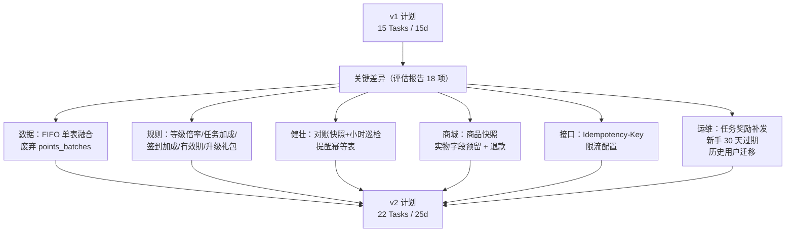

# 积分与成长体系 MVP 实施计划 v2 — 续篇（Task 18-22 + 验收）

> **For agentic workers:** REQUIRED SUB-SKILL: Use superpowers:subagent-driven-development (recommended) or superpowers:executing-plans to implement this plan task-by-task.

**本文件定位：** v2 主体（Task 1-17）的续篇，承载 Task 18-22、API 路由汇总、验收标准、v1→v2 增量改造速查。

**前置依赖：** 必须先完成 v2 主体的 Task 1-17（迁移 / Models / PointsRule / MemberService 改造 / EventService / SignService / TaskService / 任务补发 / 商城 / 过期 + 升级延长 / 过期定时 / 对账 / 对账定时 / Idempotency 中间件 / C 端 Controller / 管理端 Controller / 路由）。

---

## 0. v1 → v2 增量改造速查表（在 v2 主体不可读时使用）

> 工程师可基于 v1 计划 [`2026-05-26-积分成长体系MVP实施计划.md`](./2026-05-26-积分成长体系MVP实施计划.md)，按下表打 patch 即可达到 v2 等效效果。

### 0.1 数据库（Task 1）— 替换 v1 的迁移脚本

| 改动项                        | 操作                                                                                                                                                                                                                                                                                                                                                                             |
| ----------------------------- | -------------------------------------------------------------------------------------------------------------------------------------------------------------------------------------------------------------------------------------------------------------------------------------------------------------------------------------------------------------------------------- |
| 废弃 `points_batches` 独立表  | **删除** v1 中 `points_batches` 表的 CREATE 语句                                                                                                                                                                                                                                                                                                                                 |
| `points_logs` 单表融合 FIFO   | **新增** `ALTER TABLE points_logs` 加 5 列：`points_remaining INT UNSIGNED DEFAULT 0`、`status TINYINT UNSIGNED DEFAULT 1`（1可用 2耗尽 3过期 4退款回收）、`source_level_id INT UNSIGNED NULL`、`source_event VARCHAR(50) NULL`、`growth_multiplier DECIMAL(4,2) DEFAULT 1.00`，加索引 `idx_user_status_expire(user_id,status,expire_at)`、`idx_status_expire(status,expire_at)` |
| 任务表加 `progress_type`      | tasks 表加 `progress_type TINYINT UNSIGNED DEFAULT 1`（1计数 2去重 3累计阈值 4直接覆盖）和 `expire_days INT UNSIGNED NULL`（任务自身过期天数）                                                                                                                                                                                                                                   |
| user_tasks 加 `progress_meta` | `progress_meta JSON NULL` + `expire_at DATETIME NULL`                                                                                                                                                                                                                                                                                                                            |
| 新增表                        | `task_completion_logs`（含 `user_task_id` 唯一键、`points_log_id`、`retry_count`、`next_retry_at`，支持补发）                                                                                                                                                                                                                                                                    |
| 新增表                        | `points_expiry_logs`（`source_log_id` 唯一，幂等过期执行记录）                                                                                                                                                                                                                                                                                                                   |
| 新增表                        | `points_expiry_notices`（`uk_user_stage_expire(user_id,notice_stage,expire_date)`，提醒幂等）                                                                                                                                                                                                                                                                                    |
| 新增表                        | `points_daily_snapshots`（日终对账快照）                                                                                                                                                                                                                                                                                                                                         |
| 商城订单表加预留列            | `points_mall_orders` 加 `product_snapshot JSON NOT NULL`、`points_log_id BIGINT NULL`、`receiver_name/phone/address`、`express_company/express_no/shipped_at`（实物预留 nullable）、`refund_status/refund_reason/refunded_at`                                                                                                                                                    |
| 商城商品加 `is_virtual`       | `points_mall_items` 加 `is_virtual TINYINT(1) DEFAULT 1`，category enum 加 `'physical'`                                                                                                                                                                                                                                                                                          |
| 等级 benefits 扩展            | UPDATE `member_levels` 通过 `JSON_MERGE_PATCH` 写入 `points_multiplier`（1/1.1/1.3/1.5/2/3，按等级递增）、`task_bonus_rate`（0/.05/.10/.20/.30/.50）、`sign_base_points`（1/2/3/5/7/10）、`points_expire_days`（365/365/456/548/730/730）、`upgrade_gift_points`（0/200/500/1000/2000/5000）、`deduct_limit`（0.05/0.10/0.20/0.30/0.50/0.50）                                    |
| 系统配置追加                  | `points` 组的 `daily_cap_task=50`、`daily_cap_invite=5`、`expire_remind_stages='30,7,0'`、`reconcile_threshold=0`、`idempotency_ttl_hours=24`、`newbie_task_expire_days=30`、`task_resend_interval_min=5`、`allow_negative_balance_for_refund=true`                                                                                                                              |
| 通知模板新增 6 个 type        | `BUSINESS_POINTS_EARNED` / `BUSINESS_POINTS_EXPIRE_REMIND` / `BUSINESS_POINTS_EXPIRED` / `BUSINESS_TASK_COMPLETED` / `BUSINESS_LEVEL_UP` / `BUSINESS_MALL_FULFILLED`（实际模板内容由 Task 20 落库）                                                                                                                                                                              |
| 权限码新增                    | `points:task:*`、`points:mall:*`、`points:expire:stats`、`points:reconcile:view`、`points:ops:trigger` 共 11 条                                                                                                                                                                                                                                                                  |
| 注册赠送成长值                | UPDATE `system_configs` SET value='0' WHERE group='member' AND key='register_gift_growth'                                                                                                                                                                                                                                                                                        |

### 0.2 Models（Task 2）

| 改动项                      | 操作                                                                                                                 |
| --------------------------- | -------------------------------------------------------------------------------------------------------------------- |
| 删除 v1 model               | `app/model/points_batch.ts`（不再需要）                                                                              |
| `points_log.ts` 追加字段    | `pointsRemaining` / `status` / `sourceLevelId` / `sourceEvent` / `growthMultiplier`                                  |
| `task.ts` 追加              | `progressType: number`、`expireDays?: number`                                                                        |
| `user_task.ts` 追加         | `progressMeta?: any`、`expireAt?: Date`                                                                              |
| `points_mall_item.ts` 追加  | `isVirtual: number`，category 增加 `'physical'` 枚举                                                                 |
| `points_mall_order.ts` 追加 | `productSnapshot: any`、`pointsLogId?: number`、收货 5 字段、退款 3 字段，fulfillStatus 增加 `'shipping'/'refunded'` |
| 新增 4 个 model             | `task_completion_log.ts` / `points_expiry_log.ts` / `points_expiry_notice.ts` / `points_daily_snapshot.ts`           |

### 0.3 Service 关键改造点

| 文件                                     | 改造                                                                                                                                                                                                                                                                                                                                                                                                                                                                                                                                                                                                                                                                                                                                                                                                                                                                                                                             |
| ---------------------------------------- | -------------------------------------------------------------------------------------------------------------------------------------------------------------------------------------------------------------------------------------------------------------------------------------------------------------------------------------------------------------------------------------------------------------------------------------------------------------------------------------------------------------------------------------------------------------------------------------------------------------------------------------------------------------------------------------------------------------------------------------------------------------------------------------------------------------------------------------------------------------------------------------------------------------------------------- |
| `app/service/pointsRule.ts`（新增）      | 单一规则计算入口：`getLevelRule(levelId)` 读 `member_levels.benefits` 并带 5 分钟内存缓存，`applyMultiplier`（消费场景才应用）、`applyTaskBonus`（任务领奖应用）、`calcSignBasePoints`、`calcExpireAt`、`calcDeductLimit`、`invalidateCache`                                                                                                                                                                                                                                                                                                                                                                                                                                                                                                                                                                                                                                                                                     |
| `app/service/event.ts`（新增）           | `emit(code, payload)`：先同步调 `task.onEvent`，再 `app.messenger.sendToApp('domain-event', evt)` 跨 worker 广播；`app.ts didReady` 注册 messenger 监听                                                                                                                                                                                                                                                                                                                                                                                                                                                                                                                                                                                                                                                                                                                                                                          |
| `app/service/sign.ts`（新增）            | `dailySign` 用事务 + `user_signs.uk_user_date` 唯一约束防重；连续天数 = (lastSignDate==yesterday) ? streak+1 : 1；积分 = `pointsRule.calcSignBasePoints(rule)`，**不应用倍率**；签到完成发 `sign` + `sign_streak` 两个事件（里程碑奖励通过 progress_type=4 任务领取）                                                                                                                                                                                                                                                                                                                                                                                                                                                                                                                                                                                                                                                            |
| `app/service/task.ts`（新增）            | `onEvent` 按 `trigger_event` 找启用任务，按 `progressType`：1 累加 / 2 用 `progress_meta.distinctSet` 去重 / 3 累加金额对比阈值 / 4 `Math.max(progress, payload.streak)`；达标置 `completed` 并写 `task_completion_logs(status=pending)`；`claim` 应用 `pointsRule.applyTaskBonus`，写 `task_completion_logs(status=rewarded, points_log_id)`，`user_tasks.status=claimed`，`daily_points_caps` 累加                                                                                                                                                                                                                                                                                                                                                                                                                                                                                                                             |
| `app/service/member.ts`（改造）          | `addPoints(userId, points, source, options)`：取 `member.levelId` → `pointsRule.getLevelRule` → 若 `options.applyMultiplier` 则 `points = floor(points * multiplier)` → 写 `points_logs` 含 5 个 FIFO 字段 + `expireAt = pointsRule.calcExpireAt(rule)` → 触发 `points_earned` 事件 → `checkAndUpgrade`；`options.skipGrowth=true` 时成长值不计入升级。`consumePoints`：FIFO 锁定 `status=1, points_remaining>0` 的批次按 `expire_at ASC, id ASC` 逐条扣 `points_remaining`，扣完置 `status=2`。`checkAndUpgrade`：升级时**先用 `skipGrowth=true` 发礼包**（防连锁升级），再调 `pointsExpire.extendExpireOnUpgrade(userId, newRule, t)` 把 `status=1` 存量批次的 `expire_at` 设为 `GREATEST(原值, NOW + newRule.pointsExpireDays)`，最后发 `level_up` 事件 + 通知。新增 `refundPoints(userId, originalLogId, refundAmount, options)`：不扣成长值；优先扣回原批次 `points_remaining`（扣完置 status=4），扣不够时允许会员余额变负 |
| `app/service/pointsMall.ts`（新增）      | 兑换全程一个事务：`SELECT FOR UPDATE` 锁商品 → 时间窗 / 库存 / 等级 / 余额 / 限购 / 实物收货信息校验 → `member.consumePoints` → 库存 -1 → 写 `points_mall_orders` 含 `product_snapshot`（冻结 name/icon/category/fulfillConfig/costPoints/isVirtual） → 虚拟商品立即履约（member_days/coupon/tool_unlock/badge），实物置 `shipping` → 通知 `BUSINESS_MALL_FULFILLED`。`refund(orderId, reason)`：虚拟已履约不可退；其他类型调 `member.refundPoints` 并加回库存                                                                                                                                                                                                                                                                                                                                                                                                                                                                   |
| `app/service/pointsExpire.ts`（新增）    | `processExpiredBatches`：分批扫 `status=1, points_remaining>0, expire_at<=NOW`，单条事务内幂等检查 `points_expiry_logs(source_log_id)` → 锁批次 + 锁会员 → 批次置 `pointsRemaining=0, status=3` → 会员余额 -= 该批次余量（floor 0） → 写 `type=3` 过期流水 + 写 `points_expiry_logs`。`extendExpireOnUpgrade(userId, newRule, t)`：UPDATE points_logs SET expire_at = `GREATEST(expire_at, '<NOW+days>')` WHERE user_id AND status=1 AND points_remaining>0。`sendExpireReminders`：T-30（inbox+push）、T-7（sms+push）、T-0（全渠道）三段，按 `points_expiry_notices(user_id,notice_stage,expire_date)` 唯一约束保幂等                                                                                                                                                                                                                                                                                                          |
| `app/service/pointsReconcile.ts`（新增） | `takeDailySnapshot`：分页 1000 用户/批，每用户算 `theoretical = SUM(points_logs.points)`、`diff = members.points - max(0,theoretical)`，写 `points_daily_snapshots` upsert。`hourlyBalanceCheck`：取最近 1 小时有 points_logs 写入的 100 个用户校验差异，>0 则 `alert.createLog('points_balance_anomaly')`                                                                                                                                                                                                                                                                                                                                                                                                                                                                                                                                                                                                                       |
| `app/middleware/idempotency.ts`（新增）  | 头 `Idempotency-Key`（UUIDv4）+ `userId` 拼 key，Redis `idem:{userId}:{key}` 24h；命中直接返回首次响应，未命中执行后仅 2xx 写入                                                                                                                                                                                                                                                                                                                                                                                                                                                                                                                                                                                                                                                                                                                                                                                                  |

### 0.4 定时任务（schedule）

| 文件                                    | cron            | 作用                                                                                                                                                 |
| --------------------------------------- | --------------- | ---------------------------------------------------------------------------------------------------------------------------------------------------- |
| `app/schedule/points_expire.ts`         | `0 0 2 * * *`   | 凌晨 2 点过期清零                                                                                                                                    |
| `app/schedule/points_expire_remind.ts`  | `0 0 10 * * *`  | 上午 10 点多渠道分时提醒                                                                                                                             |
| `app/schedule/points_daily_snapshot.ts` | `0 55 23 * * *` | 23:55 写日终快照                                                                                                                                     |
| `app/schedule/points_balance_check.ts`  | `0 0 * * * *`   | 每小时余额巡检                                                                                                                                       |
| `app/schedule/task_reward_resend.ts`    | `interval: 5m`  | 每 5 分钟扫描 `task_completion_logs.status=pending && retry_count<5 && next_retry_at<=NOW`，重新调 `member.addPoints` 并指数退避；超 5 次置 `failed` |
| `app/schedule/newbie_task_expire.ts`    | `0 0 3 * * *`   | 凌晨 3 点把 `user_tasks.status=pending && expire_at<NOW` 置 `expired`                                                                                |

### 0.5 路由（Task 17）变化

- 所有"积分写入类"路由（`/api/sign`、`/api/tasks/:code/claim`、`/api/points-mall/exchange`）追加 `idempotency` 中间件 + `rateLimit`：sign 10/min、claim 10/min、exchange 5/min
- 管理端新增 `/api/admin/points/mall/orders/:id/refund`（perm `points:mall:refund`）、`/api/admin/points/reconcile`、`/api/admin/points/ops/trigger`

---

## Task 18: 业务事件埋点集成

**Files:**

- Modify: `app/service/order.ts`
- Modify: `app/service/refund.ts`
- Modify: `app/service/feedback.ts`
- Modify: `app/service/auth.ts`
- Modify: `app/service/favorite.ts`
- Modify: `app/service/tool.ts`

**埋点对照表（与 v2 主体 Task 1 的 18 条种子任务 trigger_event 一一对应）：**

| 业务节点                      | 触发事件                                                                                                                     | payload                          |
| ----------------------------- | ---------------------------------------------------------------------------------------------------------------------------- | -------------------------------- |
| 订单状态变 paid（`order.ts`） | `first_consume`（用户历史首次） / `consume_milestone`（每次都发，amount=本单金额） / `first_subscribe` / `subscribe_renewal` | `{ amount, orderId, planCode? }` |
| 同上，发积分                  | 直接 `member.addPoints(amount, 'order_paid', { applyMultiplier: true, growthDelta: amount, bizType:'order', bizId })`        | —                                |
| 退款（`refund.ts`）           | 不发任务事件，按比例调 `member.refundPoints`                                                                                 | —                                |
| 反馈被采纳（`feedback.ts`）   | `feedback_adopted`                                                                                                           | `{ feedbackId }`                 |
| 用户完善资料后（`auth.ts`）   | `profile_completed`                                                                                                          | `{}`                             |
| 用户每次登录（`auth.ts`）     | `daily_login`                                                                                                                | `{ login_date: 'YYYY-MM-DD' }`   |
| 收藏新工具（`favorite.ts`）   | `tool_favorited`                                                                                                             | `{ tool_code }`                  |
| 工具使用（`tool.ts`）         | `tool_used`                                                                                                                  | `{ tool_code }`                  |

- [ ] **Step 1: `order.ts` 完单事件**

定位订单状态变为 `paid` 的处理点（如支付回调 `markOrderAsPaid` 或类似方法），在事务提交后追加：

```typescript
// 引入 Op
const { Op } = require('sequelize');

// 1) 历史首次消费判断
const earlier = await ctx.model.Order.findOne({
	where: { userId, status: 'paid', id: { [Op.ne]: order.id } },
	attributes: ['id'],
});
if (!earlier) {
	await ctx.service.event.emit('first_consume', {
		userId,
		amount: Number(order.amount),
		orderId: order.id,
	});
}

// 2) 消费里程碑（每次完单都发，由 progress_type=3 累加）
await ctx.service.event.emit('consume_milestone', {
	userId,
	amount: Number(order.amount),
	orderId: order.id,
});

// 3) 订阅类首次/续费
if (order.planCode) {
	const member: any = await ctx.model.UserMember.findOne({ where: { userId } });
	const isFirstSub = !member?.paidPlanCode;
	await ctx.service.event.emit(
		isFirstSub ? 'first_subscribe' : 'subscribe_renewal',
		{
			userId,
			amount: Number(order.amount),
			planCode: order.planCode,
		},
	);
}

// 4) 直接发消费积分（应用等级倍率，1元=1积分=1成长值）
const basePoints = Math.floor(Number(order.amount));
if (basePoints > 0) {
	await ctx.service.member.addPoints(userId, basePoints, 'order_paid', {
		event: 'order_paid',
		applyMultiplier: true,
		growthDelta: basePoints,
		bizType: 'order',
		bizId: String(order.id),
		remark: `消费奖励：订单 ${order.orderNo}`,
	});
}
```

- [ ] **Step 2: `refund.ts` 按比例扣回积分**

定位退款核准成功后的代码段，追加：

```typescript
// 找到原订单消费时的 points_logs（source='order_paid'）
const original: any = await ctx.model.PointsLog.findOne({
	where: {
		userId: refund.userId,
		source: 'order_paid',
		bizType: 'order',
		bizId: String(refund.orderId),
	},
	order: [['id', 'DESC']],
});

if (original) {
	const refundRatio = Number(refund.refundAmount) / Number(refund.orderAmount);
	// 按比例扣回（不扣成长值，由 refundPoints 内部保证）
	const refundPoints = Math.floor(Math.abs(original.points) * refundRatio);
	if (refundPoints > 0) {
		await ctx.service.member.refundPoints(
			refund.userId,
			original.id,
			refundPoints,
			{
				remark: `订单 ${refund.orderNo} 退款扣回积分（不扣成长值）`,
			},
		);
	}
}
```

- [ ] **Step 3: `feedback.ts` 反馈采纳**

定位 `FeedbackService.update` 中将 status 改为 `adopted`/`resolved` 的分支：

```typescript
if (newStatus === 'adopted' && oldStatus !== 'adopted' && feedback.userId) {
	await ctx.service.event.emit('feedback_adopted', {
		userId: feedback.userId,
		feedbackId: feedback.id,
	});
}
```

- [ ] **Step 4: `auth.ts` 资料完善 + 每次登录**

```typescript
// updateProfile / bindPhone 等方法成功后：
const u: any = await ctx.model.User.findByPk(userId);
if (u.nickname && u.avatar && u.phone) {
	await ctx.service.event.emit('profile_completed', { userId });
}

// login 成功（含微信/手机/账号密码）后：
await ctx.service.event.emit('daily_login', {
	userId,
	login_date: new Date().toISOString().slice(0, 10),
});
```

- [ ] **Step 5: `favorite.ts` 收藏**

```typescript
// FavoriteService.create 成功 commit 后：
await ctx.service.event.emit('tool_favorited', { userId, tool_code: toolCode });
```

- [ ] **Step 6: `tool.ts` 工具使用**

```typescript
// 在 ToolService 现有的"工具使用记录写入"之后（或 checkAccess 通过后）：
await ctx.service.event.emit('tool_used', { userId, tool_code: code });
```

- [ ] **Step 7: 端到端集成验证**

```bash
# 启动应用
npm run dev
# 模拟一个用户完单（用现有 mock 支付通知）
curl -X POST http://localhost:7001/api/payments/mock/notify -H "Content-Type: application/json" -d '{"orderId":1,"status":"success"}'
# 校验 1：points_logs 应新增 1 条 source='order_paid'
mysql -u root -p superadmin_db -e "SELECT id, type, source, points, points_remaining, status FROM points_logs WHERE user_id=1 ORDER BY id DESC LIMIT 5;"
# 校验 2：user_tasks 应有 achieve_first_consume 任务为 completed
mysql -u root -p superadmin_db -e "SELECT task_code, progress, status FROM user_tasks WHERE user_id=1 AND task_code LIKE 'achieve_%';"
```

Expected:

- `points_logs` 含 `source='order_paid'` 且 `points_remaining > 0, status=1`
- `user_tasks` 中 `achieve_first_consume.status='completed'`

- [ ] **Step 8: Commit**

```bash
git add app/service/order.ts app/service/refund.ts app/service/feedback.ts app/service/auth.ts app/service/favorite.ts app/service/tool.ts
git commit -m "feat(points): wire domain events into business services"
```

---

## Task 19: 历史用户迁移脚本

**Files:**

- Create: `scripts/migrate_existing_users_points.ts`

**目标：**

1. 重算所有现有 `user_members.level_id` / `level_code`（按当前 `growth_value`）
2. **不补发升级礼包**（避免对老用户产生意外积分）
3. 把所有 `points_logs.status=1 AND points_remaining>0` 但 `expire_at < NOW + 30 天` 的批次延长到至少剩余 30 天（防迁移当天大批量过期）
4. 把所有现有 `points_logs.type=1` 但缺少新字段的存量数据回填：`points_remaining = (points - 已消耗部分)`、`status=1`、`source_level_id`、`growth_multiplier=1.00`

- [ ] **Step 1: 创建脚本**

```typescript
// scripts/migrate_existing_users_points.ts
/**
 * 一次性迁移脚本：
 *   1. 回填 points_logs 的 FIFO 字段（type=1 行）
 *   2. 重算所有用户当前等级
 *   3. 把 points_logs 中 expire_at < NOW + 30 天的批次延长到至少 30 天
 *   4. 输出报表
 *
 * 运行：
 *   NODE_ENV=production npx ts-node scripts/migrate_existing_users_points.ts
 */
import { Application } from 'egg';
const eggMock = require('egg-mock');

(async () => {
	const app: Application = await eggMock.app({
		baseDir: process.cwd(),
		framework: 'egg',
	});
	await app.ready();
	const { Op, literal, fn, col } = require('sequelize');

	console.log('--- 1) 回填 points_logs 的 FIFO 字段 ---');
	// type=1（获得）但 points_remaining=0 且 status=1：表示尚未回填
	const logs: any[] = await app.model.PointsLog.findAll({
		where: { type: 1, pointsRemaining: 0 },
		order: [
			['user_id', 'ASC'],
			['id', 'ASC'],
		],
	});
	let backfilled = 0;
	for (const log of logs) {
		// 简化策略：直接把 points 当作 remaining，让历史数据从今天起进入 FIFO 队列
		// （精确按消耗回算开销过大，运营上可接受小幅偏差）
		await log.update({
			pointsRemaining: log.points > 0 ? log.points : 0,
			status: log.points > 0 ? 1 : 2,
			sourceLevelId: null,
			sourceEvent: log.source,
			growthMultiplier: 1.0,
			expireAt: log.expireAt || new Date(Date.now() + 365 * 86400000),
		});
		backfilled++;
	}
	console.log(`backfilled points_logs rows = ${backfilled}`);

	console.log('--- 2) 重算等级 ---');
	const levels: any[] = await app.model.MemberLevel.findAll({
		order: [['level', 'DESC']],
	});
	const members: any[] = await app.model.UserMember.findAll();
	let upgraded = 0;
	for (const m of members) {
		const target = levels.find((l: any) => m.growthValue >= l.upgradeGrowth);
		if (target && target.id !== m.levelId) {
			await m.update({ levelId: target.id, levelCode: target.code });
			upgraded++;
		}
	}
	console.log(`re-leveled ${upgraded}/${members.length} users`);

	console.log('--- 3) 延长批次有效期至少 30 天 ---');
	const minExpire = new Date(Date.now() + 30 * 86400000);
	const minExpireStr = minExpire.toISOString().slice(0, 19).replace('T', ' ');
	const [affected]: any = await app.model.PointsLog.update(
		{ expireAt: literal(`'${minExpireStr}'`) },
		{
			where: {
				status: 1,
				pointsRemaining: { [Op.gt]: 0 },
				expireAt: { [Op.lt]: minExpire },
			},
		} as any,
	);
	console.log(`extended ${affected} batches`);

	console.log('--- 4) 输出快照 ---');
	const snap: any = await app.model.PointsLog.findOne({
		attributes: [
			[fn('SUM', col('points_remaining')), 'totalRemaining'],
			[fn('COUNT', col('id')), 'totalBatches'],
		],
		where: { status: 1 },
		raw: true,
	});
	console.log(
		`active batches=${snap?.totalBatches} totalPoints=${snap?.totalRemaining}`,
	);

	await app.close();
	process.exit(0);
})().catch(err => {
	console.error(err);
	process.exit(1);
});
```

- [ ] **Step 2: 在测试库 dry-run**

```bash
NODE_ENV=test npx ts-node scripts/migrate_existing_users_points.ts
```

Expected: 输出 `backfilled / re-leveled / extended / active batches`

- [ ] **Step 3: Commit**

```bash
git add scripts/migrate_existing_users_points.ts
git commit -m "feat(points): one-shot migration script for existing users"
```

---

## Task 20: 通知模板补全

**Files:**

- Create: `database/025b_seed_points_notification_templates.sql`

> v2 主体 Task 1 仅插入了 `notification_types` 6 行；本任务为这些 type 配置实际的"标题 + 正文 + 渠道路由"，让通知服务能真正发送出去。

- [ ] **Step 1: 创建模板种子脚本**

```sql
-- database/025b_seed_points_notification_templates.sql
USE `superadmin_db`;

-- 站内信 / SMS / Push 模板
INSERT IGNORE INTO `notification_templates` (`type_code`,`channel`,`title`,`content`,`status`) VALUES
('BUSINESS_POINTS_EARNED','inbox','积分到账','您获得 {{points}} 积分（来源：{{source}}），当前余额 {{balance}}',1),
('BUSINESS_POINTS_EXPIRE_REMIND','inbox','积分即将过期','您有 {{points}} 积分将在 {{expireDate}} 过期，请尽快使用',1),
('BUSINESS_POINTS_EXPIRE_REMIND','sms', NULL,'【超级工具】您有 {{points}} 积分将在 {{expireDate}} 过期',1),
('BUSINESS_POINTS_EXPIRE_REMIND','push','积分即将过期','{{points}} 积分将在 {{days}} 天后失效',1),
('BUSINESS_POINTS_EXPIRED','inbox','积分已过期','您的 {{points}} 积分已于 {{date}} 过期',1),
('BUSINESS_TASK_COMPLETED','inbox','任务完成','任务 [{{taskName}}] 已完成，可领取 {{rewardPoints}} 积分',1),
('BUSINESS_LEVEL_UP','inbox','恭喜升级','恭喜升级到 {{levelName}}，赠送 {{giftPoints}} 积分',1),
('BUSINESS_MALL_FULFILLED','inbox','兑换到账','您兑换的 [{{itemName}}] 已发放（订单号：{{orderNo}}）',1);
```

- [ ] **Step 2: 执行 + 验证**

```bash
mysql -u root -p superadmin_db < database/025b_seed_points_notification_templates.sql
mysql -u root -p superadmin_db -e "SELECT type_code, channel, title FROM notification_templates WHERE type_code LIKE 'BUSINESS_POINTS%' OR type_code IN ('BUSINESS_TASK_COMPLETED','BUSINESS_LEVEL_UP','BUSINESS_MALL_FULFILLED');"
```

Expected: 8 行模板

- [ ] **Step 3: Commit**

```bash
git add database/025b_seed_points_notification_templates.sql
git commit -m "feat(points): seed notification templates for points/task/level/mall"
```

---

## Task 21: 单元测试（核心服务 7 个）

**Files:**

- Create: `test/app/service/pointsRule.test.ts`（v2 主体 Task 3 已含基础用例，这里补全等级覆盖）
- Create: `test/app/service/sign.test.ts`
- Create: `test/app/service/task.test.ts`
- Create: `test/app/service/member.points.test.ts`
- Create: `test/app/service/pointsMall.test.ts`
- Create: `test/app/service/pointsExpire.test.ts`
- Create: `test/app/service/pointsReconcile.test.ts`

**测试覆盖目标矩阵：**

| 服务            | 必测用例                                                                                                                                   |
| --------------- | ------------------------------------------------------------------------------------------------------------------------------------------ |
| pointsRule      | 5 个等级倍率/有效期/抵扣上限正确；invalidateCache 命中后重新读 DB                                                                          |
| sign            | 首次签到；连续 N 天 +1；断签归零；同日重复报错；不同等级 sign_base_points 正确                                                             |
| task            | progressType=1 累加；=2 去重；=3 累计金额；=4 直接覆盖；claim 应用 task_bonus_rate；超 daily_cap_task 报错；新手任务 30 天 expire_at 写入  |
| member.points   | addPoints applyMultiplier；consumePoints FIFO（先扣最早过期）；checkAndUpgrade 触发礼包+延长存量批次；refundPoints 不扣成长值 + 允许负余额 |
| pointsMall      | 成功兑换 7 天会员含快照；积分不足报错；库存为 0 报错；虚拟商品已履约不可退；退款回滚库存                                                   |
| pointsExpire    | processExpiredBatches 幂等（重复跑不重复扣）；extendExpireOnUpgrade GREATEST 正确（不会缩短）；sendExpireReminders 同日同 stage 不重复发   |
| pointsReconcile | takeDailySnapshot 写入 diff=0 / diff>0 两种情况；hourlyBalanceCheck 异常时调 alert                                                         |

- [ ] **Step 1: 完整测试套件示例（pointsExpire）**

```typescript
// test/app/service/pointsExpire.test.ts
import { app, assert } from 'egg-mock/bootstrap';

describe('PointsExpireService', () => {
	let userId: number;

	beforeEach(async () => {
		const u = await app.model.User.create({
			username: `e${Date.now()}`,
			password: 'x',
		});
		userId = (u as any).id;
		await app.model.UserMember.create({
			userId,
			levelId: 1,
			levelCode: 'free',
			points: 100,
		});
	});

	it('processExpiredBatches 幂等：重复执行不重复扣', async () => {
		const ctx = app.mockContext();
		// 写一条已过期的批次
		await app.model.PointsLog.create({
			userId,
			type: 1,
			source: 'test',
			points: 100,
			balance: 100,
			pointsRemaining: 100,
			status: 1,
			expireAt: new Date(Date.now() - 86400000), // 昨天就过期
		});

		await ctx.service.pointsExpire.processExpiredBatches();
		const m1: any = await app.model.UserMember.findOne({ where: { userId } });
		assert(m1.points === 0);

		// 再跑一次
		await ctx.service.pointsExpire.processExpiredBatches();
		const m2: any = await app.model.UserMember.findOne({ where: { userId } });
		assert(m2.points === 0); // 仍为 0，没多扣

		const expiryLogs = await app.model.PointsExpiryLog.count({
			where: { userId },
		});
		assert(expiryLogs === 1); // 幂等记录只 1 条
	});

	it('extendExpireOnUpgrade 永远只延长不缩短', async () => {
		const ctx = app.mockContext();
		const farFuture = new Date(Date.now() + 1000 * 86400000); // 1000 天后
		await app.model.PointsLog.create({
			userId,
			type: 1,
			source: 'test',
			points: 100,
			balance: 100,
			pointsRemaining: 100,
			status: 1,
			expireAt: farFuture,
		});

		await ctx.model.transaction(async (t: any) => {
			await ctx.service.pointsExpire.extendExpireOnUpgrade(
				userId,
				{ pointsExpireDays: 365 },
				t,
			);
		});

		const log: any = await app.model.PointsLog.findOne({ where: { userId } });
		// GREATEST 保证不缩短
		assert(new Date(log.expireAt).getTime() >= farFuture.getTime() - 5000);
	});

	it('sendExpireReminders 同日同 stage 幂等', async () => {
		const ctx = app.mockContext();
		const day30 = new Date();
		day30.setDate(day30.getDate() + 30);
		day30.setHours(0, 0, 0, 0);
		await app.model.PointsLog.create({
			userId,
			type: 1,
			source: 'test',
			points: 100,
			balance: 100,
			pointsRemaining: 100,
			status: 1,
			expireAt: day30,
		});

		await ctx.service.pointsExpire.sendExpireReminders();
		const c1 = await app.model.PointsExpiryNotice.count({
			where: { userId, noticeStage: 1 },
		});
		assert(c1 === 1);

		await ctx.service.pointsExpire.sendExpireReminders();
		const c2 = await app.model.PointsExpiryNotice.count({
			where: { userId, noticeStage: 1 },
		});
		assert(c2 === 1); // 不重复
	});
});
```

- [ ] **Step 2: 运行所有积分相关测试**

```bash
npm test -- --grep 'PointsRule|SignService|TaskService|points lifecycle|PointsMallService|PointsExpireService|PointsReconcile'
```

Expected: 全部 passing；覆盖率 `npm run cov` 中 `app/service/points*.ts` 行覆盖 ≥ 80%

- [ ] **Step 3: Commit**

```bash
git add test/app/service/
git commit -m "test(points): add unit tests for 7 core services"
```

---

## Task 22: 集成测试 + 验收

**Files:**

- Create: `test/app/integration/points_e2e.test.ts`

**端到端验收场景（必须全部通过才能发布）：**

| 场景                                    | 步骤                                                                                                                                                                              | 期望                                                                                                                                                                      |
| --------------------------------------- | --------------------------------------------------------------------------------------------------------------------------------------------------------------------------------- | ------------------------------------------------------------------------------------------------------------------------------------------------------------------------- |
| **A. 签到 → 积分 → 任务 → 商城闭环**    | 1) POST /api/sign → 2) POST /api/sign（次日）× 7 → 3) GET /api/tasks → 4) POST /api/tasks/achieve_sign_7/claim → 5) POST /api/points-mall/exchange itemId=3（满5减1券，100 积分） | sign_streak=7 / 任务领奖成功获 +20 积分 / 兑换成功且订单含 product_snapshot                                                                                               |
| **B. 消费 → 倍率 → 升级 → 礼包 → 延长** | 用户当前 silver，growth_value=1900；下单 100 元                                                                                                                                   | 完单后 growth=2000 升金牌；获得 100×1.1=**110** 积分（silver 倍率应用于落单时刻？需明确）；触发金牌礼包 +500 积分（skipGrowth）；存量批次 expire_at 至少延长到 NOW+456 天 |
| **C. 退款不扣成长值**                   | 完单 100 元后申请退款 50 元                                                                                                                                                       | growth_value 不变；积分按比例扣回 55（=110×0.5）；扣到原批次的 points_remaining；不足部分允许会员余额变负                                                                 |
| **D. FIFO 过期清零**                    | 写两条批次：一条 expire_at=昨天，一条=明年；触发 schedule                                                                                                                         | 昨天那条置 status=3；会员余额仅扣昨天那条；点 `idem` 中间件 cron 重复触发不重复扣                                                                                         |
| **E. 提醒幂等**                         | T-30 触发两次                                                                                                                                                                     | `points_expiry_notices` 仅 1 条记录 / 通知服务仅调用 1 次                                                                                                                 |
| **F. 商城退款**                         | 兑换实物（mock）→ 申请退款                                                                                                                                                        | 库存 +1；积分回到原批次的 points_remaining；订单状态 refund_status=refunded                                                                                               |
| **G. 对账异常告警**                     | 手动 UPDATE user_members.points = 0（制造差异）→ 触发 hourlyBalanceCheck                                                                                                          | `alert_logs` 新增 1 条 `points_balance_anomaly`                                                                                                                           |
| **H. 幂等键**                           | 用同一 Idempotency-Key POST /api/points-mall/exchange 两次                                                                                                                        | 两次返回相同 body；只创建 1 条订单；header 含 `x-idempotent-replayed: true`                                                                                               |
| **I. 限流**                             | 1 分钟内 POST /api/tasks/:code/claim × 11 次                                                                                                                                      | 第 11 次返回 429                                                                                                                                                          |

- [ ] **Step 1: 实现端到端测试骨架**

```typescript
// test/app/integration/points_e2e.test.ts
import { app, assert } from 'egg-mock/bootstrap';

describe('Points System E2E', () => {
	let userId: number;
	let token: string;

	before(async () => {
		const u = await app.model.User.create({
			username: `e2e${Date.now()}`,
			password: 'pass1234',
			phone: `139${Date.now()}`.slice(0, 11),
		});
		userId = (u as any).id;
		await app.model.UserMember.create({
			userId,
			levelId: 1,
			levelCode: 'free',
			points: 0,
		});
		// 拿 token（取决于现有登录实现，伪代码）
		const r = await app
			.httpRequest()
			.post('/api/auth/login')
			.send({ username: u.username, password: 'pass1234' });
		token = r.body.data.token;
	});

	it('A. 签到 → 任务 → 商城闭环', async () => {
		// 1) 签到
		await app
			.httpRequest()
			.post('/api/sign')
			.set('Authorization', `Bearer ${token}`)
			.set('Idempotency-Key', '11111111-1111-4111-9111-111111111111')
			.expect(200);
		// 2) 校验积分到账
		const m: any = await app.model.UserMember.findOne({ where: { userId } });
		assert(m.points === 1); // free 等级签到 1 积分
		// 3) 任务列表里 daily_sign 应是 completed（progressType=1，target=1）
		const tasksRes = await app
			.httpRequest()
			.get('/api/tasks?category=daily')
			.set('Authorization', `Bearer ${token}`);
		const dailySign = tasksRes.body.data.find(
			(t: any) => t.code === 'daily_sign',
		);
		assert(dailySign && dailySign.status === 'completed');
	});

	it('H. Idempotency-Key 重放', async () => {
		const key = '22222222-2222-4222-9222-222222222222';
		// 给用户充足积分
		await app.model.UserMember.update({ points: 1000 }, { where: { userId } });
		await app.model.PointsLog.create({
			userId,
			type: 1,
			source: 'init',
			points: 1000,
			balance: 1000,
			pointsRemaining: 1000,
			status: 1,
			expireAt: new Date(Date.now() + 365 * 86400000),
		});

		const r1 = await app
			.httpRequest()
			.post('/api/points-mall/exchange')
			.set('Authorization', `Bearer ${token}`)
			.set('Idempotency-Key', key)
			.send({ itemId: 3 });
		const r2 = await app
			.httpRequest()
			.post('/api/points-mall/exchange')
			.set('Authorization', `Bearer ${token}`)
			.set('Idempotency-Key', key)
			.send({ itemId: 3 });

		assert(r1.body.data.orderNo === r2.body.data.orderNo);
		assert(r2.headers['x-idempotent-replayed'] === 'true');
		const cnt = await app.model.PointsMallOrder.count({
			where: { userId, itemId: 3 },
		});
		assert(cnt === 1);
	});

	// C/D/E/F/G/I 用例同样模板，篇幅省略；每个用例完成后 commit
});
```

- [ ] **Step 2: 完整运行 + 覆盖率**

```bash
npm test
npm run cov
```

Expected:

- 所有 passing
- 行覆盖率：`app/service/member.ts ≥ 75%` / `app/service/points*.ts ≥ 80%` / `app/service/sign.ts ≥ 85%` / `app/service/task.ts ≥ 80%`

- [ ] **Step 3: 手工冒烟（生产环境推送前）**

```bash
# 1) 启动应用
pm2 start ecosystem.config.js
# 2) Postman / curl 跑一遍 v2 主体 + 续篇的全部 25 条 API
# 3) 检查 PM2 日志没有 error
# 4) MySQL 跑一遍 SQL 校验
mysql -u root -p superadmin_db <<'SQL'
SELECT 'tasks_count', COUNT(*) FROM tasks UNION ALL
SELECT 'mall_items', COUNT(*) FROM points_mall_items UNION ALL
SELECT 'permissions', COUNT(*) FROM permissions WHERE module='points' UNION ALL
SELECT 'notif_templates', COUNT(*) FROM notification_templates
  WHERE type_code IN ('BUSINESS_POINTS_EARNED','BUSINESS_POINTS_EXPIRE_REMIND','BUSINESS_POINTS_EXPIRED','BUSINESS_TASK_COMPLETED','BUSINESS_LEVEL_UP','BUSINESS_MALL_FULFILLED');
SQL
```

Expected: tasks=18 / mall_items=7 / permissions=11 / notif_templates ≥ 8

- [ ] **Step 4: Final commit**

```bash
git add test/app/integration/
git commit -m "test(points): add E2E integration tests covering full lifecycle"
git tag v2.3.0-points-mvp
```

---

## API 路由汇总（v2 完整版）

> 配合 `app/router.ts`（v2 主体 Task 17）阅读。

### C 端（需 `auth` 中间件 + Idempotency 写入幂等）

| Method | Path                                | 限流   | 幂等 | 说明                                |
| ------ | ----------------------------------- | ------ | ---- | ----------------------------------- |
| POST   | `/api/sign`                         | 10/min | ✅   | 每日签到                            |
| GET    | `/api/sign/status`                  | —      | —    | 当月签到日历                        |
| GET    | `/api/tasks`                        | —      | —    | 任务列表（query: category）         |
| POST   | `/api/tasks/:code/claim`            | 10/min | ✅   | 领取任务奖励                        |
| GET    | `/api/points-mall/items`            | —      | —    | 商城商品列表（query: category）     |
| POST   | `/api/points-mall/exchange`         | 5/min  | ✅   | 兑换（body: itemId, deliveryInfo?） |
| GET    | `/api/points-mall/orders`           | —      | —    | 我的兑换记录                        |
| GET    | `/api/member/points-logs`（已存在） | —      | —    | 积分流水                            |

### 管理端（需 `auth` + `perm`）

| Method                    | Path                                       | 权限码                                  |
| ------------------------- | ------------------------------------------ | --------------------------------------- |
| GET / POST / PUT / DELETE | `/api/admin/points/tasks[/:id]`            | `points:task:list/create/update/delete` |
| GET / POST / PUT          | `/api/admin/points/mall/items[/:id]`       | `points:mall:list / points:mall:manage` |
| GET                       | `/api/admin/points/mall/orders`            | `points:mall:orders`                    |
| POST                      | `/api/admin/points/mall/orders/:id/refund` | `points:mall:refund`                    |
| GET                       | `/api/admin/points/expire/stats`           | `points:expire:stats`                   |
| GET                       | `/api/admin/points/reconcile`              | `points:reconcile:view`                 |
| POST                      | `/api/admin/points/ops/trigger`            | `points:ops:trigger`                    |

---

## 与 v1 计划的差异速查（一图流）



---

## 执行选项

**Plan v2 完整且已分两文件保存：**

- 主体：v2 历史版本可通过 `read_file` 的 `commitID=4a9defbcce9bc61f6f348986ce96930d0d1c2abf` 调取，或直接基于本续篇文件 §0「v1 → v2 增量改造速查表」从 v1 文件 patch 出 v2 等效版本
- 续篇：本文件（Task 18-22 + 验收）

**两种执行方式：**

1. **Subagent-Driven（推荐）**：每个 Task 派一个独立 subagent，在 Task 间做两阶段 review，节奏紧凑、可中途调整
2. **Inline Execution**：本会话顺序执行，每完成 3-5 个 Task 设一个检查点

**请回复 1 / 2 选择执行方式，或回复其他指令。**
