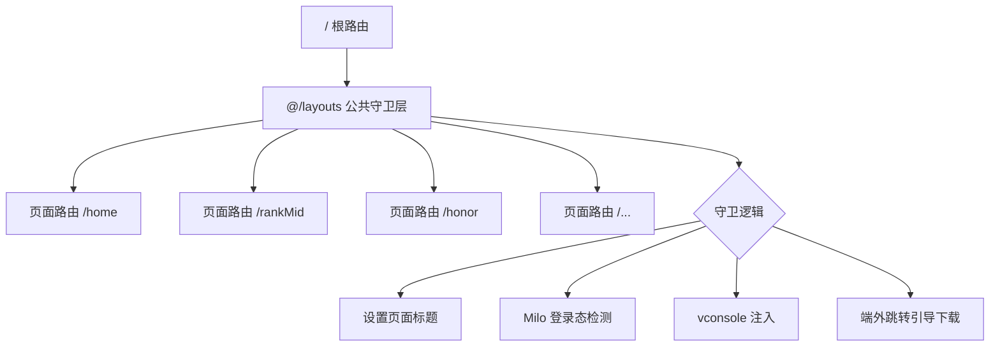
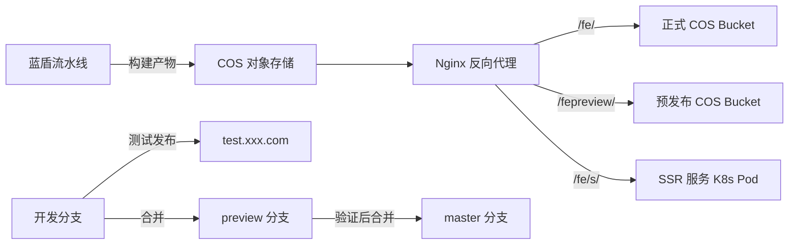

# 垂类社区 Web 项目 — 页面架构设计文档

---

## 一、项目概览

| 维度 | 说明 |
|------|------|
| **项目名称** | super-tools-web页面 |
| **技术栈** | React 16 + UmiJS 3 + Zustand + TypeScript |
| **管理模式** | Monorepo（Yarn Workspaces） |
| **应用场景** | 终端内嵌 H5 页面、PC官网 |
| **终端类型** | Hybrid App（JSBridge）/ 微信小程序 / 端外 H5 |
| **项目规模** | 10+ 游戏品类，100+ 独立子项目 |

---

## 二、目录结构设计

### 2.1 整体目录架构

```
super-tools-web/                  # Monorepo 根目录
├── packages/                     # 所有子项目
│   ├── shared/                   # 公共共享层
│   │   ├── appsdk/               # JSBridge 封装（AppSdk 类）
│   │   ├── components/           # 公共 UI 组件
│   │   ├── config/               # 公共 UmiJS 配置
│   │   ├── layouts/              # 公共布局（登录/环境检测/vconsole）
│   │   ├── utils/                # 公共工具函数（request/share/date等）
│   │   ├── hooks/                # 公共 React Hooks
│   │   ├── constants/            # 公共常量
│   │   └── contexts/             # React Context（Milo登录态）
│   │
│   ├── pc/                       # pc相关项目（子页面项目）
│   │   ├── rank/                 # 排行榜
│   │   ├── act-center/           # 活动中心
│   │   └── ...
│   ├── h5/                    		# h5相关项目（子页面项目）
│   ├── other/                    # 其他小需求
│   └── template/                 # 新项目模板（yarn gen 使用）
│
├── scripts/                      # 工程化脚本
│   ├── start.js                  # 启动脚本（设置 APP_ROOT 环境变量）
│   ├── build.js                  # 构建脚本
│   └── create/                   # 脚手架生成器（sao.js）
│
├── ui/                           # UI 组件库资源
├── nginx.conf                    # Nginx 反向代理配置
└── package.json                  # 根依赖 & Workspaces 配置
```

### 2.2 单个子项目内部结构（以 `template` 为标准模板）

```
packages/{business}/{project-name}/
├── .umirc.ts                     # 基础路由配置（继承 shared/config）
├── .umirc.dev.ts                 # 开发环境配置（代理、路由）
├── .umirc.preview.ts             # 预发布环境配置
├── .umirc.prod.ts                # 生产环境配置
├── pages/                        # 页面组件（UmiJS 约定式/配置式路由）
│   ├── document.ejs              # HTML 模板（注入 TAM 监控脚本）
│   └── home/
│       ├── index.tsx             # 页面组件
│       └── model.ts              # DVA Model（state/reducers/effects）
├── components/                   # 项目私有组件
├── layouts/                      # 项目私有布局（可覆盖 shared/layouts）
├── assets/                       # 静态资源（图片/CSS）
├── mock/                         # Mock 数据
├── service.ts                    # API 请求层
└── package.json                  # 项目标识（name 用于 yarn workspace）
```

---

## 三、路由设计

### 3.1 路由模式：配置式路由（SPA）

每个子项目采用 **UmiJS 配置式路由**，在 `.umirc.dev.ts` / `.umirc.prod.ts` 中显式声明路由树，而非文件系统约定式路由。

**路由结构示例（pc/rank2）：**

```typescript
routes: [
  {
    exact: false,
    path: '/',
    component: '@/layouts',          // 公共 Layout 守卫层
    routes: [
      { path: '/',         component: '@/pages/rank2',      title: '排行榜' },
      { path: '/rankMid',  component: '@/pages/rankMid',    title: '排行榜主页' },
      { path: '/HD',       component: '@/pages/rankHD2',    title: '排行榜HD' },
      { path: '/honor',    component: '@/pages/honorList',  title: '称号设置页' },
      { path: '/honorDetail', component: '@/pages/honorDetail' },
    ]
  }
]
```

**路由 URL 规则：**

```
/fe/{business}/{project-name}/{page-path}
```

例如：`/fe/pc/rank2/honor`、`/fe/h5/equipment/`

### 3.2 路由层级设计



### 3.3 SPA 模式说明

| 特性 | 说明 |
|------|------|
| **模式** | 每个子项目独立 SPA，项目间物理隔离 |
| **路由库** | React Router（UmiJS 内置） |
| **动态加载** | `dynamicImport` 开启，路由级代码分割 |
| **Loading 组件** | 每个项目可自定义 `Loading.tsx`，默认使用 `shared/components/Loading` |
| **Hash 模式** | 构建产物开启 `hash: true`（文件名 hash，非路由 hash） |
| **exportStatic** | 开启静态导出，每个路由生成独立 `index.html` |

---

## 四、技术方案选型

### 4.1 框架选型：UmiJS 3 + DVA

**选型理由：**

| 维度 | UmiJS + DVA | 纯 CRA | Next.js |
|------|-------------|--------|---------|
| **开箱即用** | ✅ 内置路由/构建/Mock | ❌ 需大量配置 | ✅ |
| **多项目管理** | ✅ APP_ROOT 切换 | ❌ 需多实例 | ❌ |
| **状态管理** | ✅ DVA 内置 | ❌ 需额外引入 | ❌ |
| **H5 适配** | ✅ postcss-pxtorem 内置 | ❌ | ❌ |
| **团队成本** | ✅ 统一规范 | ❌ 各自为政 | ⚠️ SSR 复杂度高 |

**优点：**
- 约定优于配置，降低新项目启动成本
- `APP_ROOT` 环境变量机制，一套 CLI 管理所有子项目
- DVA 将 Redux + Redux-Saga 整合为 Model 模式，代码组织清晰

**缺点：**
- UmiJS 3 版本较旧（当前生态已迁移至 UmiJS 4/Vite），升级成本高
- DVA 已停止维护，新项目建议迁移至 Zustand/Jotai
- 大量子项目导致 `node_modules` 体积庞大

---

### 4.2 Monorepo 方案：Yarn Workspaces

**目录映射配置（`package.json`）：**

```json
"workspaces": [
  "packages/shared",
  "packages/pc/*",
  "packages/h5/*",
  "packages/other/*",
]
```

| 维度 | Yarn Workspaces | Lerna | Nx | Turborepo |
|------|-----------------|-------|----|-----------|
| **依赖提升** | ✅ 自动 hoist | ✅ | ✅ | ✅ |
| **构建缓存** | ❌ | ⚠️ | ✅ | ✅ |
| **增量构建** | ❌ | ⚠️ | ✅ | ✅ |
| **学习成本** | ✅ 低 | ⚠️ 中 | ❌ 高 | ⚠️ 中 |
| **适合场景** | 中小规模 | 中规模 | 大规模 | 大规模 |

**优点：**
- 公共依赖（React、UmiJS）只安装一次，节省磁盘空间
- 统一的 lint/prettier/git hooks

**缺点：**
- 无构建缓存，每次全量构建耗时长
- 子项目间依赖版本冲突需手动处理（`resolutions` 字段）
- 项目数量增多后，`yarn install` 时间显著增加

---

### 4.3 状态管理：DVA（Redux + Redux-Saga）

**Model 结构：**

```typescript
const model = {
  namespace: 'home',
  state: { query: {}, data: {} },
  reducers: {
    update(state, { payload }) { return { ...state, ...payload }; }
  },
  effects: {
    * getData({ payload }, { put, select }) {
      const data = yield getData(payload);
      yield put({ type: 'update', payload: { data } });
    }
  },
  subscriptions: {
    setup({ dispatch }) {
      const { query } = history.location;
      dispatch({ type: 'update', payload: { query } });
    }
  }
};
```

| 维度 | DVA | Zustand | Jotai | Redux Toolkit |
|------|-----|---------|-------|---------------|
| **样板代码** | ❌ 多 | ✅ 少 | ✅ 少 | ⚠️ 中 |
| **异步处理** | ✅ Generator | ✅ async/await | ✅ | ✅ |
| **维护状态** | ❌ 已停维护 | ✅ 活跃 | ✅ 活跃 | ✅ 活跃 |
| **迁移成本** | — | ⚠️ 中 | ⚠️ 中 | ⚠️ 中 |

---

### 4.4 UI 适配方案：postcss-pxtorem

**配置逻辑：**

```typescript
// 创建项目时选择设计稿宽度
// 750px 设计稿 → rootValue: 20（1rem = 20px）
// 375px 设计稿 → rootValue: 10（1rem = 10px）
pxtorem({
  rootValue: 20,   // 由 yarn gen 时选择
  propList: ['*'], // 所有 CSS 属性均转换
  exclude: /node_modules/i,
})
```

**配合 rem 基准 CSS：**
- 引用 `https://bb.img.qq.com/clsq/rem/rem37_5-v1.css` 设置根字体大小
- 开发者直接使用设计稿 px 值，构建时自动转换为 rem

| 方案 | postcss-pxtorem | vw/vh | flexible.js |
|------|-----------------|-------|-------------|
| **兼容性** | ✅ 好 | ✅ 现代浏览器 | ⚠️ 旧方案 |
| **开发体验** | ✅ 直接写 px | ✅ | ❌ 需换算 |
| **精度** | ✅ | ✅ | ⚠️ |

---

### 4.5 JSBridge 接入：AppSdk

**核心设计：**

```
AppSdk（单例）
├── 环境检测（isApp / isIOS / isAndroid / isMiniApp / isXinyue）
├── 就绪检测（GameHelper 注入检测，重试机制）
├── ensure() 装饰器（确保 App 环境就绪后执行）
├── getAppParams() （从 URL/SessionStorage 获取 App 下发参数）
└── 页面导航（openNewPage / openNewPageEx / openNewPageWithSwitch）
```

**参数传递机制：**
- App 通过 URL Query String 下发参数（`userId`、`token`、`gameId` 等）
- `AppSdk.getAppParams()` 解析并缓存到 `sessionStorage`，防止 SPA 路由跳转后参数丢失

---

### 4.6 网络请求层：umi-request 封装

**请求拦截器功能：**

```
customRequest（基于 umi-request extend）
├── 自动注入登录态（userId / token / cGameId）
├── 自动注入系统信息（cSystem）
├── 请求签名（sig 参数，HMAC 签名）
├── Clsq-Verify 验证头（base64 编码的 token;uin;userId）
└── 统一错误处理（HTTP 状态码映射）
```

---

## 五、构建与部署工作流

### 5.1 多环境构建策略

```
UMI_ENV 环境变量控制配置文件加载：

.umirc.ts          ← 基础配置（路由、alias、pxtorem）
    ↓ merge
.umirc.dev.ts      ← 开发环境（proxy 代理、vconsole）
.umirc.preview.ts  ← 预发布环境（preview CDN 路径）
.umirc.prod.ts     ← 生产环境（prod CDN 路径）
```

**构建命令：**

```bash
yarn start h5/equipment          # 开发（UMI_ENV=dev）
yarn build h5/equipment          # 构建（默认 dev）
yarn build-preview h5/equipment  # 预发布构建
yarn build-prod h5/equipment     # 生产构建
yarn build-analyze h5/equipment  # Bundle 分析
```

### 5.2 Webpack 分包策略

```
构建产物 chunks：
├── vendors.js      ← React + React-DOM + React-Router（基础框架）
├── miloCore.js     ← @umijs/* + @tencent/milo-core（UMI框架层）
├── async-commons.js ← 异步加载的公共模块（minChunks: 2）
├── commons.js      ← 同步加载的公共模块（minChunks: 2）
└── umi.js          ← 业务代码入口
```

**图片优化：** 生产环境启用 `image-webpack-loader`（mozjpeg 压缩）

### 5.3 部署架构



**CDN 路径规则：**
- 正式：`https://xxx.com/fe/{business}/{project}/`
- 预发布：`https://xxx.com/fepreview/{business}/{project}/`
- 测试：`https://test.xxx.com/{business}/{project}/`

### 5.4 Git 工作流

```
master（正式）← preview（预发布）← feature/xxx（开发分支）
                                        ↓
                                   测试环境（流水线选分支发布）
```

| 分支 | 用途 | 发布方式 |
|------|------|---------|
| `master` | 正式环境 | 只能从 preview 合并 |
| `preview` | 预发布验证 | 从开发分支合并 |
| `feature/*` | 日常开发 | 流水线发布测试 |

---

## 六、监控与可观测性


## 七、新项目创建工作流

```bash
yarn gen
# 交互式选择：
# 1. 业务分类（h5/pc/other）
# 2. 项目名称（字母+中划线）
# 3. 设计稿宽度（750px 或 375px）
# 4. 是否允许端外打开
```

**生成器（sao.js）** 将 `packages/template` 复制到 `packages/{business}/{project-name}`，并替换模板变量（`<%= parent %>`、`<%= projectName %>`、`<%= designWidth %>`、`<%= openPage %>`）。

---

## 八、架构优缺点总结

### ✅ 优点

1. **物理隔离**：每个子项目独立 SPA，互不影响，故障隔离性好
2. **代码复用**：`shared` 层统一管理公共组件/工具/配置，避免重复造轮子
3. **统一工作流**：一套 CLI（`yarn start/build/gen`）管理所有项目，降低运维成本
4. **快速启动**：`yarn gen` 脚手架 30 秒创建标准化新项目
5. **多环境支持**：dev/preview/prod 三套配置，环境切换清晰
6. **JSBridge 封装**：`AppSdk` 统一处理 App 环境检测和 Native 调用，屏蔽平台差异

### ❌ 缺点 / 待优化点

1. **构建性能**：无增量构建缓存，项目数量多时全量构建耗时长（建议引入 Turborepo）
2. **技术债务**：UmiJS 3 + DVA 已停止维护，需规划升级至 UmiJS 4 + Vite + Zustand
3. **包体积**：部分老项目未做代码分割，首屏 JS 体积偏大
4. **SSR 覆盖率低**：SSR 渲染服务（`ssr-render`）仅覆盖少数页面，SEO 优化空间大
5. **测试覆盖**：缺乏系统性单元测试和 E2E 测试体系
6. **依赖管理**：`yarn.lock` 近 1MB，依赖版本冲突需通过 `resolutions` 手动处理

---

## 九、架构演进建议

```
当前架构                    →    演进方向
─────────────────────────────────────────────────────
UmiJS 3 + Webpack           →    UmiJS 4 / Vite（构建提速 10x）
DVA（停维护）               →    Zustand / Jotai（轻量状态管理）
Yarn Workspaces（无缓存）   →    Turborepo（增量构建缓存）
手动 TAM 注入               →    统一监控 SDK 自动注入
纯 CSR SPA                  →    关键页面 SSR/SSG（SEO 优化）
```